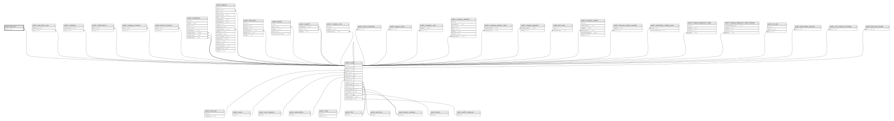

# public.devices

## Description

## Columns

| Name       | Type                           | Default                             | Nullable | Parents                         |
| ---------- | ------------------------------ | ----------------------------------- | -------- | ------------------------------- |
| id         | bigint                         | nextval('devices_id_seq'::regclass) | false    |                                 |
| fcm_token  | text                           |                                     | false    |                                 |
| type       | varchar(255)                   |                                     | false    |                                 |
| user_id    | bigint                         |                                     | true     | [public.users](public.users.md) |
| created_at | timestamp(0) without time zone |                                     | true     |                                 |
| updated_at | timestamp(0) without time zone |                                     | true     |                                 |

## Constraints

| Name                    | Type        | Definition                                                   |
| ----------------------- | ----------- | ------------------------------------------------------------ |
| devices_user_id_foreign | FOREIGN KEY | FOREIGN KEY (user_id) REFERENCES users(id) ON DELETE CASCADE |
| devices_pkey            | PRIMARY KEY | PRIMARY KEY (id)                                             |

## Indexes

| Name                  | Definition                                                                 |
| --------------------- | -------------------------------------------------------------------------- |
| devices_pkey          | CREATE UNIQUE INDEX devices_pkey ON public.devices USING btree (id)        |
| devices_user_id_index | CREATE INDEX devices_user_id_index ON public.devices USING btree (user_id) |

## Relations

---

> Generated by [tbls](https://github.com/k1LoW/tbls)
