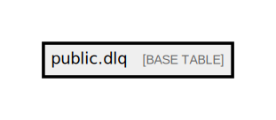

# public.dlq

## Description

## Columns

| Name            | Type                           | Default                         | Nullable |
| --------------- | ------------------------------ | ------------------------------- | -------- |
| id              | bigint                         | nextval('dlq_id_seq'::regclass) | false    |
| topic           | text                           |                                 | false    |
| key             | text                           |                                 | true     |
| message         | json                           |                                 | false    |
| consumer_group  | varchar(255)                   |                                 | false    |
| message_offset  | integer                        |                                 | false    |
| partition       | integer                        |                                 | false    |
| created_at      | timestamp(0) without time zone |                                 | true     |
| updated_at      | timestamp(0) without time zone |                                 | true     |
| errors          | json                           |                                 | true     |
| queue_timestamp | timestamp(0) without time zone |                                 | true     |
| retry_count     | integer                        | 0                               | false    |
| retried_at      | timestamp(0) without time zone |                                 | true     |

## Constraints

| Name     | Type        | Definition       |
| -------- | ----------- | ---------------- |
| dlq_pkey | PRIMARY KEY | PRIMARY KEY (id) |

## Indexes

| Name     | Definition                                                  |
| -------- | ----------------------------------------------------------- |
| dlq_pkey | CREATE UNIQUE INDEX dlq_pkey ON public.dlq USING btree (id) |

## Relations

---

> Generated by [tbls](https://github.com/k1LoW/tbls)
