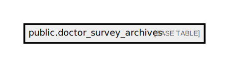

# public.doctor_survey_archives

## Description

## Columns

| Name         | Type                           | Default                                            | Nullable |
| ------------ | ------------------------------ | -------------------------------------------------- | -------- |
| id           | bigint                         | nextval('doctor_survey_archives_id_seq'::regclass) | false    |
| account_code | varchar(255)                   |                                                    | false    |
| month        | integer                        |                                                    | true     |
| extra_data   | json                           |                                                    | true     |
| triggered_at | timestamp(0) without time zone |                                                    | false    |
| created_at   | timestamp(0) without time zone |                                                    | true     |
| updated_at   | timestamp(0) without time zone |                                                    | true     |

## Constraints

| Name                        | Type        | Definition       |
| --------------------------- | ----------- | ---------------- |
| doctor_survey_archives_pkey | PRIMARY KEY | PRIMARY KEY (id) |

## Indexes

| Name                        | Definition                                                                                        |
| --------------------------- | ------------------------------------------------------------------------------------------------- |
| doctor_survey_archives_pkey | CREATE UNIQUE INDEX doctor_survey_archives_pkey ON public.doctor_survey_archives USING btree (id) |

## Relations

---

> Generated by [tbls](https://github.com/k1LoW/tbls)
