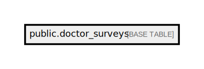

# public.doctor_surveys

## Description

## Columns

| Name         | Type                           | Default                                    | Nullable |
| ------------ | ------------------------------ | ------------------------------------------ | -------- |
| id           | bigint                         | nextval('doctor_surveys_id_seq'::regclass) | false    |
| account_code | varchar(255)                   |                                            | false    |
| status       | varchar(10)                    |                                            | false    |
| month        | integer                        |                                            | true     |
| extra_data   | json                           |                                            | true     |
| triggered_at | timestamp(0) without time zone |                                            | false    |
| created_at   | timestamp(0) without time zone |                                            | true     |
| updated_at   | timestamp(0) without time zone |                                            | true     |

## Constraints

| Name                | Type        | Definition       |
| ------------------- | ----------- | ---------------- |
| doctor_surveys_pkey | PRIMARY KEY | PRIMARY KEY (id) |

## Indexes

| Name                | Definition                                                                        |
| ------------------- | --------------------------------------------------------------------------------- |
| doctor_surveys_pkey | CREATE UNIQUE INDEX doctor_surveys_pkey ON public.doctor_surveys USING btree (id) |

## Relations

---

> Generated by [tbls](https://github.com/k1LoW/tbls)
