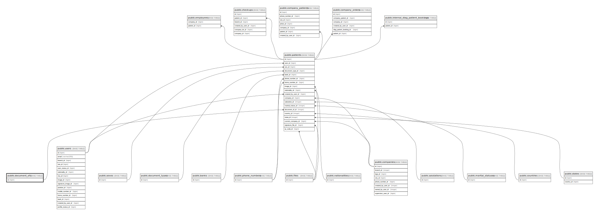

# public.document_ofs

## Description

## Columns

| Name | Type         | Default                                  | Nullable | Children                              |
| ---- | ------------ | ---------------------------------------- | -------- | ------------------------------------- |
| id   | bigint       | nextval('document_ofs_id_seq'::regclass) | false    | [public.patients](public.patients.md) |
| name | varchar(255) |                                          | false    |                                       |
| slug | varchar(255) |                                          | false    |                                       |

## Constraints

| Name              | Type        | Definition       |
| ----------------- | ----------- | ---------------- |
| document_ofs_pkey | PRIMARY KEY | PRIMARY KEY (id) |

## Indexes

| Name              | Definition                                                                    |
| ----------------- | ----------------------------------------------------------------------------- |
| document_ofs_pkey | CREATE UNIQUE INDEX document_ofs_pkey ON public.document_ofs USING btree (id) |

## Relations

---

> Generated by [tbls](https://github.com/k1LoW/tbls)
