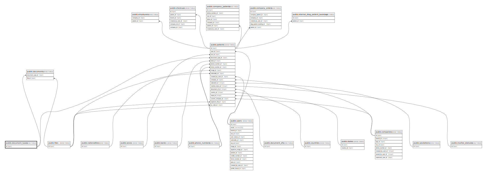

# public.document_types

## Description

## Columns

| Name | Type         | Default                                    | Nullable | Children                                                                      |
| ---- | ------------ | ------------------------------------------ | -------- | ----------------------------------------------------------------------------- |
| id   | bigint       | nextval('document_types_id_seq'::regclass) | false    | [public.patients](public.patients.md) [public.documents](public.documents.md) |
| slug | varchar(255) |                                            | false    |                                                                               |
| name | varchar(255) |                                            | false    |                                                                               |

## Constraints

| Name                       | Type        | Definition       |
| -------------------------- | ----------- | ---------------- |
| document_types_pkey        | PRIMARY KEY | PRIMARY KEY (id) |
| document_types_slug_unique | UNIQUE      | UNIQUE (slug)    |

## Indexes

| Name                       | Definition                                                                                 |
| -------------------------- | ------------------------------------------------------------------------------------------ |
| document_types_pkey        | CREATE UNIQUE INDEX document_types_pkey ON public.document_types USING btree (id)          |
| document_types_slug_unique | CREATE UNIQUE INDEX document_types_slug_unique ON public.document_types USING btree (slug) |

## Relations

---

> Generated by [tbls](https://github.com/k1LoW/tbls)
