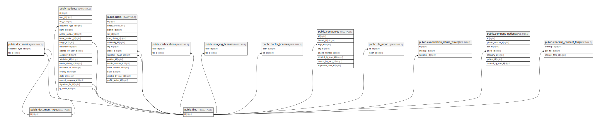

# public.documents

## Description

## Columns

| Name              | Type                           | Default                               | Nullable | Parents                                           |
| ----------------- | ------------------------------ | ------------------------------------- | -------- | ------------------------------------------------- |
| id                | bigint                         | nextval('documents_id_seq'::regclass) | false    |                                                   |
| number            | varchar(255)                   |                                       | false    |                                                   |
| documentable_type | varchar(255)                   |                                       | false    |                                                   |
| documentable_id   | bigint                         |                                       | false    |                                                   |
| document_type_id  | bigint                         |                                       | false    | [public.document_types](public.document_types.md) |
| file_id           | bigint                         |                                       | true     | [public.files](public.files.md)                   |
| created_at        | timestamp(0) without time zone |                                       | true     |                                                   |
| updated_at        | timestamp(0) without time zone |                                       | true     |                                                   |

## Constraints

| Name                               | Type        | Definition                                                   |
| ---------------------------------- | ----------- | ------------------------------------------------------------ |
| documents_document_type_id_foreign | FOREIGN KEY | FOREIGN KEY (document_type_id) REFERENCES document_types(id) |
| documents_file_id_foreign          | FOREIGN KEY | FOREIGN KEY (file_id) REFERENCES files(id)                   |
| documents_pkey                     | PRIMARY KEY | PRIMARY KEY (id)                                             |

## Indexes

| Name                                              | Definition                                                                                                                          |
| ------------------------------------------------- | ----------------------------------------------------------------------------------------------------------------------------------- |
| documents_pkey                                    | CREATE UNIQUE INDEX documents_pkey ON public.documents USING btree (id)                                                             |
| documents_documentable_type_documentable_id_index | CREATE INDEX documents_documentable_type_documentable_id_index ON public.documents USING btree (documentable_type, documentable_id) |

## Relations

---

> Generated by [tbls](https://github.com/k1LoW/tbls)
