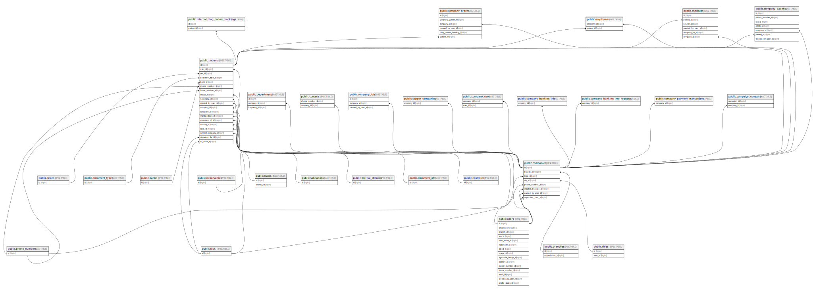

# public.employees

## Description

## Columns

| Name       | Type                           | Default                               | Nullable | Parents                                 |
| ---------- | ------------------------------ | ------------------------------------- | -------- | --------------------------------------- |
| id         | bigint                         | nextval('employees_id_seq'::regclass) | false    |                                         |
| company_id | bigint                         |                                       | false    | [public.companies](public.companies.md) |
| created_at | timestamp(0) without time zone |                                       | true     |                                         |
| updated_at | timestamp(0) without time zone |                                       | true     |                                         |
| patient_id | bigint                         |                                       | false    | [public.patients](public.patients.md)   |

## Constraints

| Name                         | Type        | Definition                                                          |
| ---------------------------- | ----------- | ------------------------------------------------------------------- |
| employees_company_id_foreign | FOREIGN KEY | FOREIGN KEY (company_id) REFERENCES companies(id) ON DELETE CASCADE |
| employees_pkey               | PRIMARY KEY | PRIMARY KEY (id)                                                    |
| employees_patient_id_foreign | FOREIGN KEY | FOREIGN KEY (patient_id) REFERENCES patients(id) ON DELETE CASCADE  |

## Indexes

| Name           | Definition                                                              |
| -------------- | ----------------------------------------------------------------------- |
| employees_pkey | CREATE UNIQUE INDEX employees_pkey ON public.employees USING btree (id) |

## Relations

---

> Generated by [tbls](https://github.com/k1LoW/tbls)
