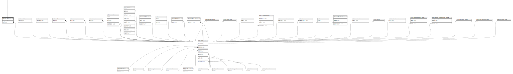

# public.etl_jobs

## Description

## Columns

| Name                | Type                           | Default                              | Nullable | Children                              | Parents                               |
| ------------------- | ------------------------------ | ------------------------------------ | -------- | ------------------------------------- | ------------------------------------- |
| id                  | bigint                         | nextval('etl_jobs_id_seq'::regclass) | false    | [public.etl_jobs](public.etl_jobs.md) |                                       |
| parent_id           | bigint                         |                                      | true     |                                       | [public.etl_jobs](public.etl_jobs.md) |
| user_id             | bigint                         |                                      | true     |                                       | [public.users](public.users.md)       |
| type                | varchar(50)                    |                                      | false    |                                       |                                       |
| status              | varchar(30)                    |                                      | false    |                                       |                                       |
| total_children      | integer                        |                                      | true     |                                       |                                       |
| total_success_child | integer                        |                                      | true     |                                       |                                       |
| data                | json                           |                                      | true     |                                       |                                       |
| extra_data          | json                           |                                      | true     |                                       |                                       |
| created_at          | timestamp(0) without time zone |                                      | true     |                                       |                                       |
| updated_at          | timestamp(0) without time zone |                                      | true     |                                       |                                       |

## Constraints

| Name                       | Type        | Definition                                      |
| -------------------------- | ----------- | ----------------------------------------------- |
| etl_jobs_user_id_foreign   | FOREIGN KEY | FOREIGN KEY (user_id) REFERENCES users(id)      |
| etl_jobs_parent_id_foreign | FOREIGN KEY | FOREIGN KEY (parent_id) REFERENCES etl_jobs(id) |
| etl_jobs_pkey              | PRIMARY KEY | PRIMARY KEY (id)                                |

## Indexes

| Name                | Definition                                                             |
| ------------------- | ---------------------------------------------------------------------- |
| etl_jobs_pkey       | CREATE UNIQUE INDEX etl_jobs_pkey ON public.etl_jobs USING btree (id)  |
| etl_jobs_type_index | CREATE INDEX etl_jobs_type_index ON public.etl_jobs USING btree (type) |

## Relations

---

> Generated by [tbls](https://github.com/k1LoW/tbls)
