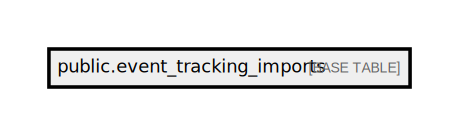

# public.event_tracking_imports

## Description

## Columns

| Name       | Type                           | Default                                            | Nullable |
| ---------- | ------------------------------ | -------------------------------------------------- | -------- |
| id         | bigint                         | nextval('event_tracking_imports_id_seq'::regclass) | false    |
| date       | date                           |                                                    | false    |
| synced     | boolean                        |                                                    | false    |
| created_at | timestamp(0) without time zone |                                                    | true     |
| updated_at | timestamp(0) without time zone |                                                    | true     |

## Constraints

| Name                        | Type        | Definition       |
| --------------------------- | ----------- | ---------------- |
| event_tracking_imports_pkey | PRIMARY KEY | PRIMARY KEY (id) |

## Indexes

| Name                        | Definition                                                                                        |
| --------------------------- | ------------------------------------------------------------------------------------------------- |
| event_tracking_imports_pkey | CREATE UNIQUE INDEX event_tracking_imports_pkey ON public.event_tracking_imports USING btree (id) |

## Relations

---

> Generated by [tbls](https://github.com/k1LoW/tbls)
