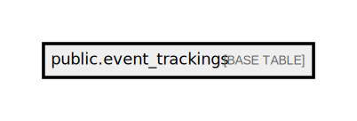

# public.event_trackings

## Description

## Columns

| Name         | Type                           | Default                                     | Nullable |
| ------------ | ------------------------------ | ------------------------------------------- | -------- |
| id           | bigint                         | nextval('event_trackings_id_seq'::regclass) | false    |
| account_code | varchar(255)                   |                                             | true     |
| event_name   | varchar(255)                   |                                             | false    |
| payload      | json                           |                                             | false    |
| created_at   | timestamp(0) without time zone |                                             | true     |
| updated_at   | timestamp(0) without time zone |                                             | true     |

## Constraints

| Name                 | Type        | Definition       |
| -------------------- | ----------- | ---------------- |
| event_trackings_pkey | PRIMARY KEY | PRIMARY KEY (id) |

## Indexes

| Name                                   | Definition                                                                                                              |
| -------------------------------------- | ----------------------------------------------------------------------------------------------------------------------- |
| event_trackings_pkey                   | CREATE UNIQUE INDEX event_trackings_pkey ON public.event_trackings USING btree (id)                                     |
| event_trackings_md5_payload_unique_idx | CREATE UNIQUE INDEX event_trackings_md5_payload_unique_idx ON public.event_trackings USING btree (md5((payload)::text)) |

## Relations

---

> Generated by [tbls](https://github.com/k1LoW/tbls)
