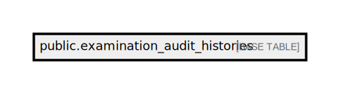

# public.examination_audit_histories

## Description

## Columns

| Name       | Type                           | Default                                                 | Nullable |
| ---------- | ------------------------------ | ------------------------------------------------------- | -------- |
| id         | bigint                         | nextval('examination_audit_histories_id_seq'::regclass) | false    |
| checkup_id | bigint                         |                                                         | false    |
| service_id | bigint                         |                                                         | false    |
| status     | varchar(255)                   |                                                         | false    |
| event      | varchar(255)                   |                                                         | false    |
| created_at | timestamp(0) without time zone |                                                         | true     |
| updated_at | timestamp(0) without time zone |                                                         | true     |
| updated_by | json                           |                                                         | true     |

## Constraints

| Name                             | Type        | Definition       |
| -------------------------------- | ----------- | ---------------- |
| examination_audit_histories_pkey | PRIMARY KEY | PRIMARY KEY (id) |

## Indexes

| Name                             | Definition                                                                                                  |
| -------------------------------- | ----------------------------------------------------------------------------------------------------------- |
| examination_audit_histories_pkey | CREATE UNIQUE INDEX examination_audit_histories_pkey ON public.examination_audit_histories USING btree (id) |

## Relations

---

> Generated by [tbls](https://github.com/k1LoW/tbls)
