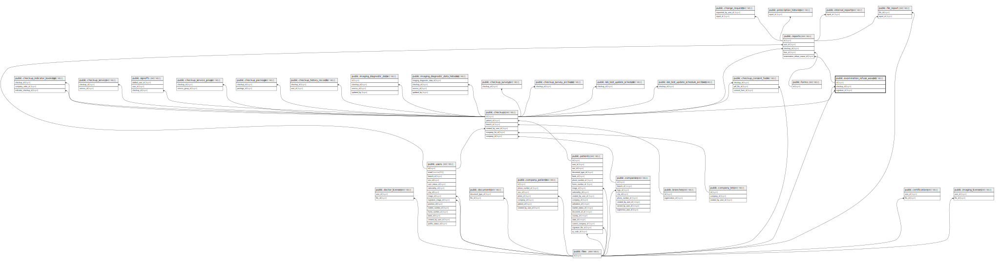

# public.examination_refuse_wavers

## Description

## Columns

| Name         | Type                           | Default                                               | Nullable | Children                            | Parents                               |
| ------------ | ------------------------------ | ----------------------------------------------------- | -------- | ----------------------------------- | ------------------------------------- |
| id           | bigint                         | nextval('examination_refuse_wavers_id_seq'::regclass) | false    | [public.reports](public.reports.md) |                                       |
| checkup_id   | bigint                         |                                                       | false    |                                     | [public.checkups](public.checkups.md) |
| signature_id | bigint                         |                                                       | true     |                                     | [public.files](public.files.md)       |
| signed_at    | timestamp(0) without time zone |                                                       | true     |                                     |                                       |
| created_at   | timestamp(0) without time zone |                                                       | true     |                                     |                                       |
| updated_at   | timestamp(0) without time zone |                                                       | true     |                                     |                                       |

## Constraints

| Name                                           | Type        | Definition                                                         |
| ---------------------------------------------- | ----------- | ------------------------------------------------------------------ |
| examination_refuse_wavers_signature_id_foreign | FOREIGN KEY | FOREIGN KEY (signature_id) REFERENCES files(id) ON DELETE CASCADE  |
| examination_refuse_wavers_checkup_id_foreign   | FOREIGN KEY | FOREIGN KEY (checkup_id) REFERENCES checkups(id) ON DELETE CASCADE |
| examination_refuse_wavers_pkey                 | PRIMARY KEY | PRIMARY KEY (id)                                                   |
| examination_refuse_wavers_checkup_id_unique    | UNIQUE      | UNIQUE (checkup_id)                                                |

## Indexes

| Name                                        | Definition                                                                                                                   |
| ------------------------------------------- | ---------------------------------------------------------------------------------------------------------------------------- |
| examination_refuse_wavers_pkey              | CREATE UNIQUE INDEX examination_refuse_wavers_pkey ON public.examination_refuse_wavers USING btree (id)                      |
| examination_refuse_wavers_checkup_id_unique | CREATE UNIQUE INDEX examination_refuse_wavers_checkup_id_unique ON public.examination_refuse_wavers USING btree (checkup_id) |

## Relations

---

> Generated by [tbls](https://github.com/k1LoW/tbls)
