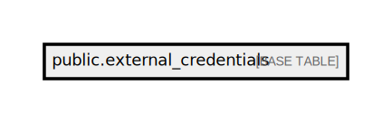

# public.external_credentials

## Description

## Columns

| Name       | Type                           | Default                                          | Nullable |
| ---------- | ------------------------------ | ------------------------------------------------ | -------- |
| id         | bigint                         | nextval('external_credentials_id_seq'::regclass) | false    |
| copper_id  | integer                        |                                                  | false    |
| api_key    | varchar(255)                   |                                                  | false    |
| data       | json                           |                                                  | false    |
| created_at | timestamp(0) without time zone |                                                  | true     |
| updated_at | timestamp(0) without time zone |                                                  | true     |
| deleted_at | timestamp(0) without time zone |                                                  | true     |

## Constraints

| Name                                | Type        | Definition       |
| ----------------------------------- | ----------- | ---------------- |
| external_credentials_pkey           | PRIMARY KEY | PRIMARY KEY (id) |
| unique_external_credentials_api_key | UNIQUE      | UNIQUE (api_key) |

## Indexes

| Name                                | Definition                                                                                                   |
| ----------------------------------- | ------------------------------------------------------------------------------------------------------------ |
| external_credentials_pkey           | CREATE UNIQUE INDEX external_credentials_pkey ON public.external_credentials USING btree (id)                |
| unique_external_credentials_api_key | CREATE UNIQUE INDEX unique_external_credentials_api_key ON public.external_credentials USING btree (api_key) |

## Relations

---

> Generated by [tbls](https://github.com/k1LoW/tbls)
