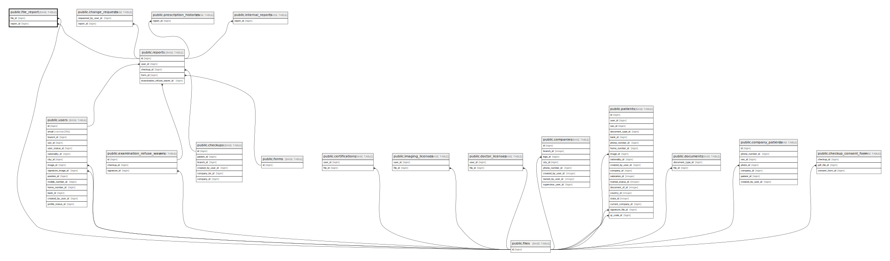

# public.file_report

## Description

## Columns

| Name      | Type         | Default                                 | Nullable | Parents                             |
| --------- | ------------ | --------------------------------------- | -------- | ----------------------------------- |
| id        | bigint       | nextval('file_report_id_seq'::regclass) | false    |                                     |
| file_id   | bigint       |                                         | false    | [public.files](public.files.md)     |
| report_id | bigint       |                                         | false    | [public.reports](public.reports.md) |
| key       | varchar(255) |                                         | true     |                                     |

## Constraints

| Name                          | Type        | Definition                                     |
| ----------------------------- | ----------- | ---------------------------------------------- |
| file_report_file_id_foreign   | FOREIGN KEY | FOREIGN KEY (file_id) REFERENCES files(id)     |
| file_report_report_id_foreign | FOREIGN KEY | FOREIGN KEY (report_id) REFERENCES reports(id) |
| file_report_pkey              | PRIMARY KEY | PRIMARY KEY (id)                               |

## Indexes

| Name             | Definition                                                                  |
| ---------------- | --------------------------------------------------------------------------- |
| file_report_pkey | CREATE UNIQUE INDEX file_report_pkey ON public.file_report USING btree (id) |

## Relations

---

> Generated by [tbls](https://github.com/k1LoW/tbls)
