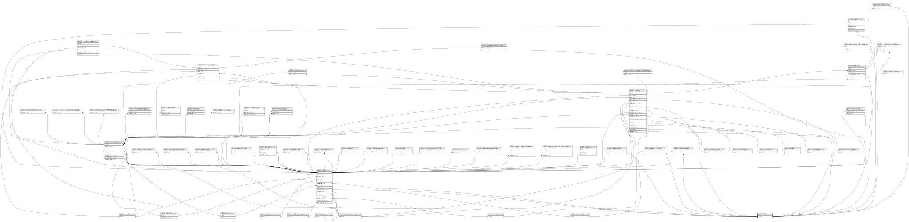

# public.files

## Description

## Columns

| Name       | Type                           | Default                           | Nullable | Children                                                                                                                                                                                                                                                                                                                                                                                                                                                                                                                                                  |
| ---------- | ------------------------------ | --------------------------------- | -------- | --------------------------------------------------------------------------------------------------------------------------------------------------------------------------------------------------------------------------------------------------------------------------------------------------------------------------------------------------------------------------------------------------------------------------------------------------------------------------------------------------------------------------------------------------------- |
| id         | bigint                         | nextval('files_id_seq'::regclass) | false    | [public.users](public.users.md) [public.certifications](public.certifications.md) [public.imaging_licenses](public.imaging_licenses.md) [public.doctor_licenses](public.doctor_licenses.md) [public.companies](public.companies.md) [public.patients](public.patients.md) [public.file_report](public.file_report.md) [public.documents](public.documents.md) [public.examination_refuse_wavers](public.examination_refuse_wavers.md) [public.company_patients](public.company_patients.md) [public.checkup_consent_form](public.checkup_consent_form.md) |
| path       | varchar(255)                   |                                   | false    |                                                                                                                                                                                                                                                                                                                                                                                                                                                                                                                                                           |
| created_at | timestamp(0) without time zone |                                   | true     |                                                                                                                                                                                                                                                                                                                                                                                                                                                                                                                                                           |
| updated_at | timestamp(0) without time zone |                                   | true     |                                                                                                                                                                                                                                                                                                                                                                                                                                                                                                                                                           |

## Constraints

| Name       | Type        | Definition       |
| ---------- | ----------- | ---------------- |
| files_pkey | PRIMARY KEY | PRIMARY KEY (id) |

## Indexes

| Name             | Definition                                                       |
| ---------------- | ---------------------------------------------------------------- |
| files_pkey       | CREATE UNIQUE INDEX files_pkey ON public.files USING btree (id)  |
| files_path_index | CREATE INDEX files_path_index ON public.files USING btree (path) |

## Relations

---

> Generated by [tbls](https://github.com/k1LoW/tbls)
