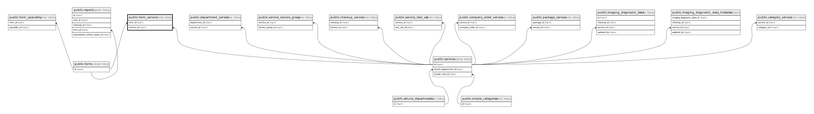

# public.form_service

## Description

## Columns

| Name       | Type   | Default                                  | Nullable | Parents                               |
| ---------- | ------ | ---------------------------------------- | -------- | ------------------------------------- |
| id         | bigint | nextval('form_service_id_seq'::regclass) | false    |                                       |
| form_id    | bigint |                                          | false    | [public.forms](public.forms.md)       |
| service_id | bigint |                                          | false    | [public.services](public.services.md) |

## Constraints

| Name                            | Type        | Definition                                                         |
| ------------------------------- | ----------- | ------------------------------------------------------------------ |
| form_service_service_id_foreign | FOREIGN KEY | FOREIGN KEY (service_id) REFERENCES services(id) ON DELETE CASCADE |
| form_service_form_id_foreign    | FOREIGN KEY | FOREIGN KEY (form_id) REFERENCES forms(id) ON DELETE CASCADE       |
| form_service_pkey               | PRIMARY KEY | PRIMARY KEY (id)                                                   |

## Indexes

| Name                                  | Definition                                                                                                  |
| ------------------------------------- | ----------------------------------------------------------------------------------------------------------- |
| form_service_pkey                     | CREATE UNIQUE INDEX form_service_pkey ON public.form_service USING btree (id)                               |
| form_service_form_id_service_id_index | CREATE INDEX form_service_form_id_service_id_index ON public.form_service USING btree (form_id, service_id) |
| form_service_form_id_index            | CREATE INDEX form_service_form_id_index ON public.form_service USING btree (form_id)                        |
| form_service_service_id_index         | CREATE INDEX form_service_service_id_index ON public.form_service USING btree (service_id)                  |
| checkupsapi_fs_formid_serviceid       | CREATE INDEX checkupsapi_fs_formid_serviceid ON public.form_service USING btree (form_id, service_id)       |

## Relations

---

> Generated by [tbls](https://github.com/k1LoW/tbls)
