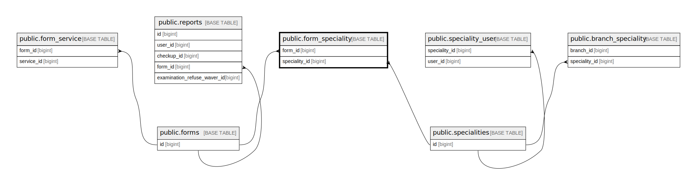

# public.form_speciality

## Description

## Columns

| Name          | Type   | Default                                     | Nullable | Parents                                       |
| ------------- | ------ | ------------------------------------------- | -------- | --------------------------------------------- |
| id            | bigint | nextval('form_speciality_id_seq'::regclass) | false    |                                               |
| form_id       | bigint |                                             | false    | [public.forms](public.forms.md)               |
| speciality_id | bigint |                                             | false    | [public.specialities](public.specialities.md) |

## Constraints

| Name                                  | Type        | Definition                                                                |
| ------------------------------------- | ----------- | ------------------------------------------------------------------------- |
| form_speciality_speciality_id_foreign | FOREIGN KEY | FOREIGN KEY (speciality_id) REFERENCES specialities(id) ON DELETE CASCADE |
| form_speciality_form_id_foreign       | FOREIGN KEY | FOREIGN KEY (form_id) REFERENCES forms(id) ON DELETE CASCADE              |
| form_speciality_pkey                  | PRIMARY KEY | PRIMARY KEY (id)                                                          |

## Indexes

| Name                                | Definition                                                                                                      |
| ----------------------------------- | --------------------------------------------------------------------------------------------------------------- |
| form_speciality_pkey                | CREATE UNIQUE INDEX form_speciality_pkey ON public.form_speciality USING btree (id)                             |
| form_speciality_form_id_index       | CREATE INDEX form_speciality_form_id_index ON public.form_speciality USING btree (form_id)                      |
| form_speciality_speciality_id_index | CREATE INDEX form_speciality_speciality_id_index ON public.form_speciality USING btree (speciality_id)          |
| checkupsapi_fsp_specialityid_formid | CREATE INDEX checkupsapi_fsp_specialityid_formid ON public.form_speciality USING btree (speciality_id, form_id) |

## Relations

---

> Generated by [tbls](https://github.com/k1LoW/tbls)
