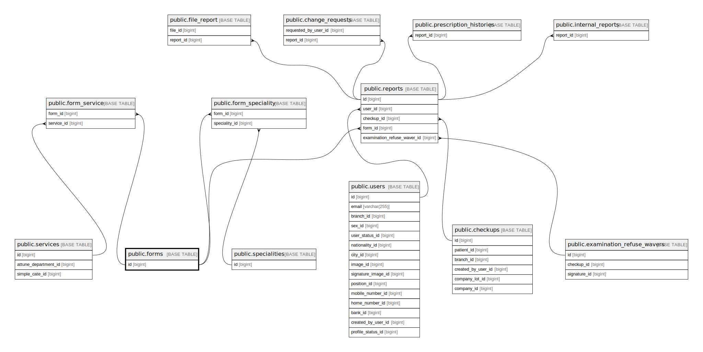

# public.forms

## Description

## Columns

| Name        | Type         | Default                           | Nullable | Children                                                                                                                              |
| ----------- | ------------ | --------------------------------- | -------- | ------------------------------------------------------------------------------------------------------------------------------------- |
| id          | bigint       | nextval('forms_id_seq'::regclass) | false    | [public.form_service](public.form_service.md) [public.form_speciality](public.form_speciality.md) [public.reports](public.reports.md) |
| code        | varchar(255) |                                   | false    |                                                                                                                                       |
| name        | varchar(255) |                                   | false    |                                                                                                                                       |
| config_data | json         |                                   | true     |                                                                                                                                       |

## Constraints

| Name              | Type        | Definition       |
| ----------------- | ----------- | ---------------- |
| forms_pkey        | PRIMARY KEY | PRIMARY KEY (id) |
| forms_code_unique | UNIQUE      | UNIQUE (code)    |

## Indexes

| Name              | Definition                                                               |
| ----------------- | ------------------------------------------------------------------------ |
| forms_pkey        | CREATE UNIQUE INDEX forms_pkey ON public.forms USING btree (id)          |
| forms_code_unique | CREATE UNIQUE INDEX forms_code_unique ON public.forms USING btree (code) |

## Relations

---

> Generated by [tbls](https://github.com/k1LoW/tbls)
