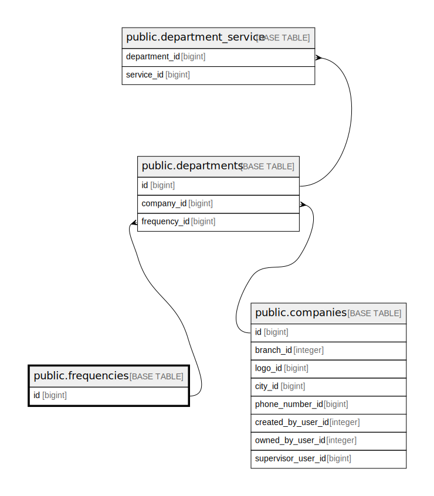

# public.frequencies

## Description

## Columns

| Name | Type         | Default                                 | Nullable | Children                                    |
| ---- | ------------ | --------------------------------------- | -------- | ------------------------------------------- |
| id   | bigint       | nextval('frequencies_id_seq'::regclass) | false    | [public.departments](public.departments.md) |
| slug | varchar(255) |                                         | false    |                                             |
| name | varchar(255) |                                         | false    |                                             |

## Constraints

| Name                    | Type        | Definition       |
| ----------------------- | ----------- | ---------------- |
| frequencies_pkey        | PRIMARY KEY | PRIMARY KEY (id) |
| frequencies_slug_unique | UNIQUE      | UNIQUE (slug)    |

## Indexes

| Name                    | Definition                                                                           |
| ----------------------- | ------------------------------------------------------------------------------------ |
| frequencies_pkey        | CREATE UNIQUE INDEX frequencies_pkey ON public.frequencies USING btree (id)          |
| frequencies_slug_unique | CREATE UNIQUE INDEX frequencies_slug_unique ON public.frequencies USING btree (slug) |

## Relations

---

> Generated by [tbls](https://github.com/k1LoW/tbls)
