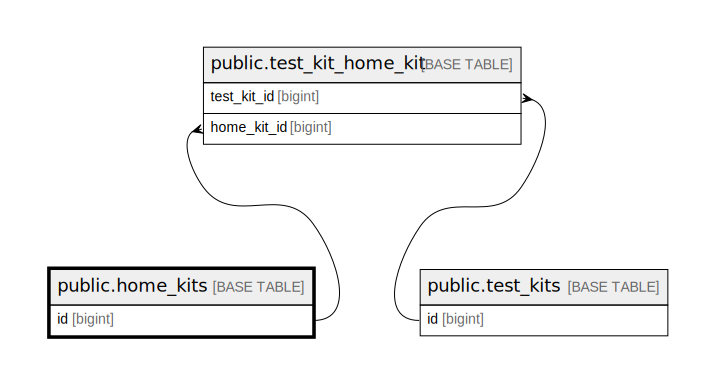

# public.home_kits

## Description

## Columns

| Name                | Type                           | Default                               | Nullable | Children                                                |
| ------------------- | ------------------------------ | ------------------------------------- | -------- | ------------------------------------------------------- |
| id                  | bigint                         | nextval('home_kits_id_seq'::regclass) | false    | [public.test_kit_home_kit](public.test_kit_home_kit.md) |
| sku                 | varchar(255)                   |                                       | true     |                                                         |
| status              | varchar(255)                   | 'available'::character varying        | false    |                                                         |
| created_at          | timestamp(0) without time zone |                                       | true     |                                                         |
| updated_at          | timestamp(0) without time zone |                                       | true     |                                                         |
| images              | json                           |                                       | true     |                                                         |
| is_synced           | boolean                        | false                                 | false    |                                                         |
| incremental_kit_id  | integer                        |                                       | true     |                                                         |
| hash                | text                           |                                       | true     |                                                         |
| short_link          | varchar(500)                   |                                       | true     |                                                         |
| sample_collected_at | timestamp(0) with time zone    |                                       | true     |                                                         |
| sample_rejected_at  | timestamp(0) with time zone    |                                       | true     |                                                         |

## Constraints

| Name                   | Type        | Definition                                                                                                                                                                                                            |
| ---------------------- | ----------- | --------------------------------------------------------------------------------------------------------------------------------------------------------------------------------------------------------------------- |
| home_kits_status_check | CHECK       | CHECK (((status)::text = ANY (ARRAY[('available'::character varying)::text, ('unavailable'::character varying)::text, ('sample_rejected'::character varying)::text, ('sample_collected'::character varying)::text]))) |
| home_kits_pkey         | PRIMARY KEY | PRIMARY KEY (id)                                                                                                                                                                                                      |
| home_kits_sku_unique   | UNIQUE      | UNIQUE (sku)                                                                                                                                                                                                          |

## Indexes

| Name                 | Definition                                                                     |
| -------------------- | ------------------------------------------------------------------------------ |
| home_kits_pkey       | CREATE UNIQUE INDEX home_kits_pkey ON public.home_kits USING btree (id)        |
| home_kits_sku_unique | CREATE UNIQUE INDEX home_kits_sku_unique ON public.home_kits USING btree (sku) |

## Relations

---

> Generated by [tbls](https://github.com/k1LoW/tbls)
