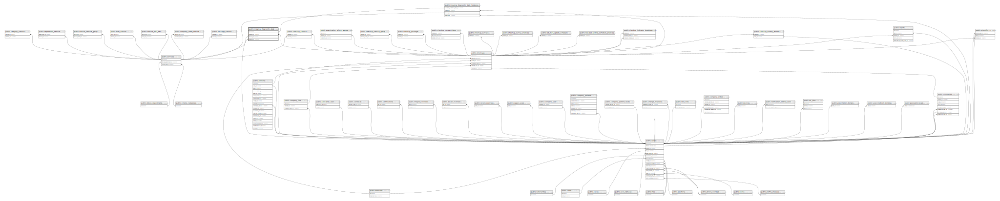

# public.imaging_diagnostic_data

## Description

## Columns

| Name          | Type                           | Default                                             | Nullable | Children                                                                                | Parents                               |
| ------------- | ------------------------------ | --------------------------------------------------- | -------- | --------------------------------------------------------------------------------------- | ------------------------------------- |
| id            | bigint                         | nextval('imaging_diagnostic_data_id_seq'::regclass) | false    | [public.imaging_diagnostic_data_histories](public.imaging_diagnostic_data_histories.md) |                                       |
| type          | varchar(255)                   |                                                     | false    |                                                                                         |                                       |
| status        | varchar(255)                   |                                                     | false    |                                                                                         |                                       |
| checkup_id    | bigint                         |                                                     | true     |                                                                                         | [public.checkups](public.checkups.md) |
| service_id    | bigint                         |                                                     | true     |                                                                                         | [public.services](public.services.md) |
| capture_user  | json                           |                                                     | true     |                                                                                         |                                       |
| data_version  | character(10)                  | 'v1'::bpchar                                        | false    |                                                                                         |                                       |
| data          | json                           |                                                     | false    |                                                                                         |                                       |
| capture_date  | timestamp(0) without time zone |                                                     | true     |                                                                                         |                                       |
| submit_date   | timestamp(0) without time zone |                                                     | true     |                                                                                         |                                       |
| created_at    | timestamp(0) without time zone |                                                     | true     |                                                                                         |                                       |
| updated_at    | timestamp(0) without time zone |                                                     | true     |                                                                                         |                                       |
| transmit_date | timestamp(0) without time zone |                                                     | true     |                                                                                         |                                       |
| updated_by    | bigint                         |                                                     | true     |                                                                                         | [public.users](public.users.md)       |

## Constraints

| Name                                       | Type        | Definition                                                                                                                                                                              |
| ------------------------------------------ | ----------- | --------------------------------------------------------------------------------------------------------------------------------------------------------------------------------------- |
| imaging_diagnostic_data_status_check       | CHECK       | CHECK (((status)::text = ANY (ARRAY[('in-progress'::character varying)::text, ('ready'::character varying)::text, ('awaiting-conclusion'::character varying)::text])))                  |
| imaging_diagnostic_data_type_check         | CHECK       | CHECK (((type)::text = ANY (ARRAY[('x-ray'::character varying)::text, ('ultrasound'::character varying)::text, ('ecg'::character varying)::text, ('obgyn'::character varying)::text]))) |
| imaging_diagnostic_data_updated_by_foreign | FOREIGN KEY | FOREIGN KEY (updated_by) REFERENCES users(id)                                                                                                                                           |
| imaging_diagnostic_data_service_id_foreign | FOREIGN KEY | FOREIGN KEY (service_id) REFERENCES services(id) ON DELETE CASCADE                                                                                                                      |
| imaging_diagnostic_data_checkup_id_foreign | FOREIGN KEY | FOREIGN KEY (checkup_id) REFERENCES checkups(id) ON DELETE CASCADE                                                                                                                      |
| imaging_diagnostic_data_pkey               | PRIMARY KEY | PRIMARY KEY (id)                                                                                                                                                                        |

## Indexes

| Name                                                | Definition                                                                                                                              |
| --------------------------------------------------- | --------------------------------------------------------------------------------------------------------------------------------------- |
| imaging_diagnostic_data_pkey                        | CREATE UNIQUE INDEX imaging_diagnostic_data_pkey ON public.imaging_diagnostic_data USING btree (id)                                     |
| imaging_diagnostic_data_checkup_id_service_id_index | CREATE INDEX imaging_diagnostic_data_checkup_id_service_id_index ON public.imaging_diagnostic_data USING btree (checkup_id, service_id) |
| imaging_diagnostic_data_checkup_id_index            | CREATE INDEX imaging_diagnostic_data_checkup_id_index ON public.imaging_diagnostic_data USING btree (checkup_id)                        |
| imaging_diagnostic_data_service_id_index            | CREATE INDEX imaging_diagnostic_data_service_id_index ON public.imaging_diagnostic_data USING btree (service_id)                        |
| imaging_diagnostic_data_status_index                | CREATE INDEX imaging_diagnostic_data_status_index ON public.imaging_diagnostic_data USING btree (status)                                |

## Relations

---

> Generated by [tbls](https://github.com/k1LoW/tbls)
