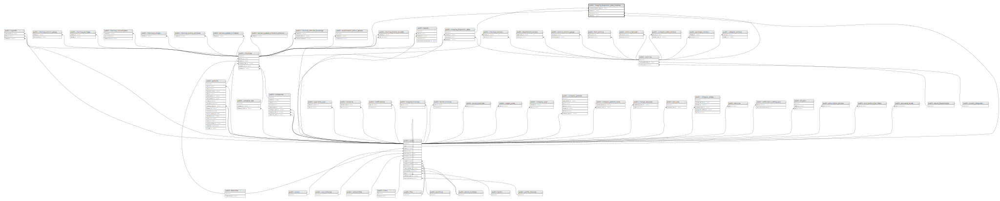

# public.imaging_diagnostic_data_histories

## Description

## Columns

| Name                       | Type                           | Default                                                       | Nullable | Parents                                                             |
| -------------------------- | ------------------------------ | ------------------------------------------------------------- | -------- | ------------------------------------------------------------------- |
| id                         | bigint                         | nextval('imaging_diagnostic_data_histories_id_seq'::regclass) | false    |                                                                     |
| imaging_diagnostic_data_id | bigint                         |                                                               | false    | [public.imaging_diagnostic_data](public.imaging_diagnostic_data.md) |
| version                    | character(10)                  | 'v1'::bpchar                                                  | false    |                                                                     |
| type                       | varchar(255)                   |                                                               | false    |                                                                     |
| status                     | varchar(255)                   |                                                               | false    |                                                                     |
| checkup_id                 | bigint                         |                                                               | true     | [public.checkups](public.checkups.md)                               |
| service_id                 | bigint                         |                                                               | true     | [public.services](public.services.md)                               |
| capture_user               | json                           |                                                               | true     |                                                                     |
| data_version               | character(10)                  | 'v1'::bpchar                                                  | false    |                                                                     |
| data                       | json                           |                                                               | false    |                                                                     |
| capture_date               | timestamp(0) without time zone |                                                               | true     |                                                                     |
| submit_date                | timestamp(0) without time zone |                                                               | true     |                                                                     |
| created_at                 | timestamp(0) without time zone |                                                               | true     |                                                                     |
| updated_at                 | timestamp(0) without time zone |                                                               | true     |                                                                     |
| transmit_date              | timestamp(0) without time zone |                                                               | true     |                                                                     |
| updated_by                 | bigint                         |                                                               | true     | [public.users](public.users.md)                                     |

## Constraints

| Name                                                            | Type        | Definition                                                                                                                                                             |
| --------------------------------------------------------------- | ----------- | ---------------------------------------------------------------------------------------------------------------------------------------------------------------------- |
| imaging_diagnostic_data_histories_status_check                  | CHECK       | CHECK (((status)::text = ANY (ARRAY[('in-progress'::character varying)::text, ('ready'::character varying)::text, ('awaiting-conclusion'::character varying)::text]))) |
| imaging_diagnostic_data_histories_type_check                    | CHECK       | CHECK (((type)::text = ANY (ARRAY[('x-ray'::character varying)::text, ('ultrasound'::character varying)::text, ('ecg'::character varying)::text])))                    |
| imaging_diagnostic_data_histories_updated_by_foreign            | FOREIGN KEY | FOREIGN KEY (updated_by) REFERENCES users(id)                                                                                                                          |
| imaging_diagnostic_data_histories_service_id_foreign            | FOREIGN KEY | FOREIGN KEY (service_id) REFERENCES services(id) ON DELETE CASCADE                                                                                                     |
| imaging_diagnostic_data_histories_checkup_id_foreign            | FOREIGN KEY | FOREIGN KEY (checkup_id) REFERENCES checkups(id) ON DELETE CASCADE                                                                                                     |
| imaging_diagnostic_data_histories_imaging_diagnostic_data_id_fo | FOREIGN KEY | FOREIGN KEY (imaging_diagnostic_data_id) REFERENCES imaging_diagnostic_data(id) ON DELETE CASCADE                                                                      |
| imaging_diagnostic_data_histories_pkey                          | PRIMARY KEY | PRIMARY KEY (id)                                                                                                                                                       |

## Indexes

| Name                                   | Definition                                                                                                              |
| -------------------------------------- | ----------------------------------------------------------------------------------------------------------------------- |
| imaging_diagnostic_data_histories_pkey | CREATE UNIQUE INDEX imaging_diagnostic_data_histories_pkey ON public.imaging_diagnostic_data_histories USING btree (id) |

## Relations

---

> Generated by [tbls](https://github.com/k1LoW/tbls)
