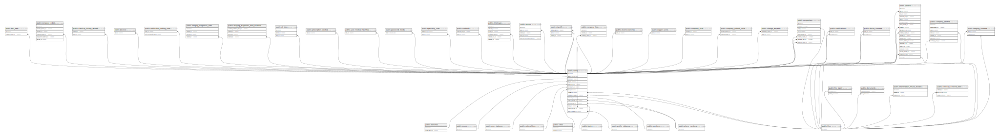

# public.imaging_licenses

## Description

## Columns

| Name             | Type                           | Default                                      | Nullable | Parents                         |
| ---------------- | ------------------------------ | -------------------------------------------- | -------- | ------------------------------- |
| id               | bigint                         | nextval('imaging_licenses_id_seq'::regclass) | false    |                                 |
| number           | varchar(255)                   |                                              | false    |                                 |
| user_id          | bigint                         |                                              | false    | [public.users](public.users.md) |
| file_id          | bigint                         |                                              | false    | [public.files](public.files.md) |
| created_at       | timestamp(0) without time zone |                                              | true     |                                 |
| updated_at       | timestamp(0) without time zone |                                              | true     |                                 |
| pending_approval | boolean                        | false                                        | false    |                                 |

## Constraints

| Name                             | Type        | Definition                                                    |
| -------------------------------- | ----------- | ------------------------------------------------------------- |
| imaging_licenses_user_id_foreign | FOREIGN KEY | FOREIGN KEY (user_id) REFERENCES users(id) ON DELETE CASCADE  |
| imaging_licenses_file_id_foreign | FOREIGN KEY | FOREIGN KEY (file_id) REFERENCES files(id) ON DELETE SET NULL |
| imaging_licenses_pkey            | PRIMARY KEY | PRIMARY KEY (id)                                              |
| imaging_licenses_user_id_unique  | UNIQUE      | UNIQUE (user_id)                                              |

## Indexes

| Name                            | Definition                                                                                           |
| ------------------------------- | ---------------------------------------------------------------------------------------------------- |
| imaging_licenses_pkey           | CREATE UNIQUE INDEX imaging_licenses_pkey ON public.imaging_licenses USING btree (id)                |
| imaging_licenses_user_id_unique | CREATE UNIQUE INDEX imaging_licenses_user_id_unique ON public.imaging_licenses USING btree (user_id) |

## Relations

---

> Generated by [tbls](https://github.com/k1LoW/tbls)
