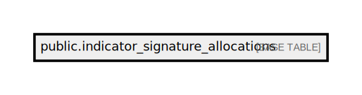

# public.indicator_signature_allocations

## Description

## Columns

| Name                     | Type                           | Default                                                     | Nullable |
| ------------------------ | ------------------------------ | ----------------------------------------------------------- | -------- |
| id                       | bigint                         | nextval('indicator_signature_allocations_id_seq'::regclass) | false    |
| signature_diag_user_name | varchar(255)                   |                                                             | false    |
| from_time                | time(0) without time zone      |                                                             | false    |
| to_time                  | time(0) without time zone      |                                                             | false    |
| days_of_week             | varchar(255)                   |                                                             | false    |
| created_at               | timestamp(0) without time zone |                                                             | true     |
| updated_at               | timestamp(0) without time zone |                                                             | true     |

## Constraints

| Name                                 | Type        | Definition       |
| ------------------------------------ | ----------- | ---------------- |
| indicator_signature_allocations_pkey | PRIMARY KEY | PRIMARY KEY (id) |

## Indexes

| Name                                 | Definition                                                                                                          |
| ------------------------------------ | ------------------------------------------------------------------------------------------------------------------- |
| indicator_signature_allocations_pkey | CREATE UNIQUE INDEX indicator_signature_allocations_pkey ON public.indicator_signature_allocations USING btree (id) |

## Relations

---

> Generated by [tbls](https://github.com/k1LoW/tbls)
