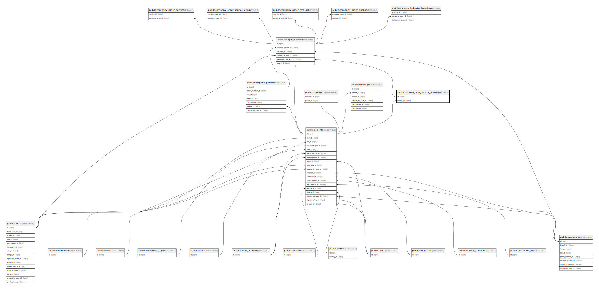

# public.internal_diag_patient_bookings

## Description

## Columns

| Name               | Type                           | Default                                                    | Nullable | Children                                          | Parents                               |
| ------------------ | ------------------------------ | ---------------------------------------------------------- | -------- | ------------------------------------------------- | ------------------------------------- |
| id                 | bigint                         | nextval('internal_diag_patient_bookings_id_seq'::regclass) | false    | [public.company_orders](public.company_orders.md) |                                       |
| full_name          | varchar(255)                   |                                                            | false    |                                                   |                                       |
| dob                | date                           |                                                            | false    |                                                   |                                       |
| note               | text                           |                                                            | true     |                                                   |                                       |
| id_number          | varchar(255)                   |                                                            | true     |                                                   |                                       |
| id_number_type     | varchar(255)                   |                                                            | true     |                                                   |                                       |
| email              | varchar(255)                   |                                                            | true     |                                                   |                                       |
| phone_number       | varchar(255)                   |                                                            | false    |                                                   |                                       |
| gender             | varchar(20)                    |                                                            | false    |                                                   |                                       |
| attachments        | jsonb                          |                                                            | true     |                                                   |                                       |
| address            | varchar(255)                   |                                                            | true     |                                                   |                                       |
| ward               | varchar(255)                   |                                                            | true     |                                                   |                                       |
| district           | varchar(255)                   |                                                            | true     |                                                   |                                       |
| city               | varchar(100)                   |                                                            | true     |                                                   |                                       |
| country            | varchar(60)                    |                                                            | true     |                                                   |                                       |
| company_id         | bigint                         |                                                            | true     |                                                   |                                       |
| patient_id         | bigint                         |                                                            | true     |                                                   | [public.patients](public.patients.md) |
| created_by_user_id | bigint                         |                                                            | false    |                                                   |                                       |
| created_at         | timestamp(0) without time zone |                                                            | true     |                                                   |                                       |
| updated_at         | timestamp(0) without time zone |                                                            | true     |                                                   |                                       |
| metadata           | json                           |                                                            | true     |                                                   |                                       |

## Constraints

| Name                                              | Type        | Definition                                       |
| ------------------------------------------------- | ----------- | ------------------------------------------------ |
| internal_diag_patient_bookings_patient_id_foreign | FOREIGN KEY | FOREIGN KEY (patient_id) REFERENCES patients(id) |
| internal_diag_patient_bookings_pkey               | PRIMARY KEY | PRIMARY KEY (id)                                 |

## Indexes

| Name                                | Definition                                                                                                        |
| ----------------------------------- | ----------------------------------------------------------------------------------------------------------------- |
| internal_diag_patient_bookings_pkey | CREATE UNIQUE INDEX internal_diag_patient_bookings_pkey ON public.internal_diag_patient_bookings USING btree (id) |

## Relations

---

> Generated by [tbls](https://github.com/k1LoW/tbls)
