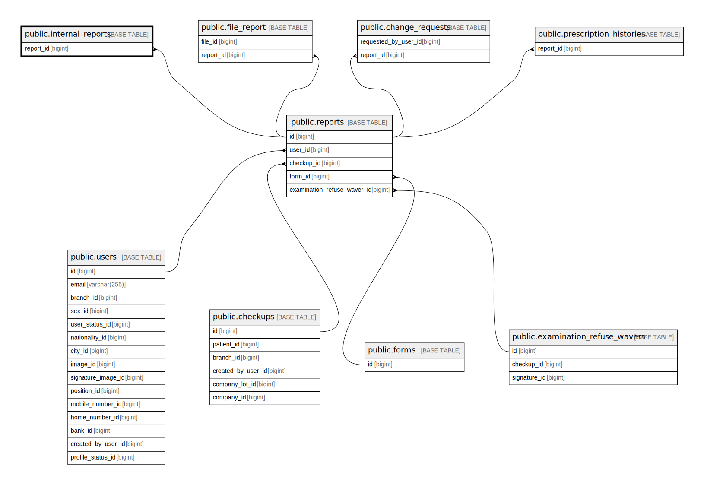

# public.internal_reports

## Description

## Columns

| Name       | Type                           | Default                                      | Nullable | Parents                             |
| ---------- | ------------------------------ | -------------------------------------------- | -------- | ----------------------------------- |
| id         | bigint                         | nextval('internal_reports_id_seq'::regclass) | false    |                                     |
| created_at | timestamp(0) without time zone |                                              | true     |                                     |
| updated_at | timestamp(0) without time zone |                                              | true     |                                     |
| report_id  | bigint                         |                                              | false    | [public.reports](public.reports.md) |
| verified   | boolean                        |                                              | false    |                                     |
| content    | jsonb                          |                                              | true     |                                     |
| extra_data | jsonb                          |                                              | true     |                                     |

## Constraints

| Name                               | Type        | Definition                                     |
| ---------------------------------- | ----------- | ---------------------------------------------- |
| internal_reports_report_id_foreign | FOREIGN KEY | FOREIGN KEY (report_id) REFERENCES reports(id) |
| internal_reports_pkey              | PRIMARY KEY | PRIMARY KEY (id)                               |
| internal_reports_report_id_unique  | UNIQUE      | UNIQUE (report_id)                             |

## Indexes

| Name                              | Definition                                                                                               |
| --------------------------------- | -------------------------------------------------------------------------------------------------------- |
| internal_reports_pkey             | CREATE UNIQUE INDEX internal_reports_pkey ON public.internal_reports USING btree (id)                    |
| internal_reports_report_id_unique | CREATE UNIQUE INDEX internal_reports_report_id_unique ON public.internal_reports USING btree (report_id) |

## Relations

---

> Generated by [tbls](https://github.com/k1LoW/tbls)
