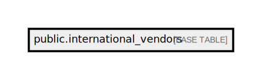

# public.international_vendors

## Description

## Columns

| Name         | Type                           | Default                                           | Nullable |
| ------------ | ------------------------------ | ------------------------------------------------- | -------- |
| id           | bigint                         | nextval('international_vendors_id_seq'::regclass) | false    |
| laboratory   | varchar(50)                    |                                                   | false    |
| country_code | varchar(3)                     |                                                   | false    |
| created_at   | timestamp(0) without time zone |                                                   | true     |
| updated_at   | timestamp(0) without time zone |                                                   | true     |

## Constraints

| Name                                    | Type        | Definition          |
| --------------------------------------- | ----------- | ------------------- |
| international_vendors_pkey              | PRIMARY KEY | PRIMARY KEY (id)    |
| international_vendors_laboratory_unique | UNIQUE      | UNIQUE (laboratory) |

## Indexes

| Name                                    | Definition                                                                                                           |
| --------------------------------------- | -------------------------------------------------------------------------------------------------------------------- |
| international_vendors_pkey              | CREATE UNIQUE INDEX international_vendors_pkey ON public.international_vendors USING btree (id)                      |
| international_vendors_laboratory_unique | CREATE UNIQUE INDEX international_vendors_laboratory_unique ON public.international_vendors USING btree (laboratory) |

## Relations

---

> Generated by [tbls](https://github.com/k1LoW/tbls)
