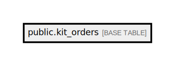

# public.kit_orders

## Description

## Columns

| Name                   | Type                           | Default                                | Nullable | Comment              |
| ---------------------- | ------------------------------ | -------------------------------------- | -------- | -------------------- |
| id                     | bigint                         | nextval('kit_orders_id_seq'::regclass) | false    |                      |
| full_name              | varchar(255)                   |                                        | false    |                      |
| email                  | varchar(255)                   |                                        | false    |                      |
| kit_type               | varchar(50)                    |                                        | false    |                      |
| phone_number           | varchar(20)                    |                                        | false    |                      |
| address                | varchar(255)                   |                                        | false    |                      |
| expected_delivery_date | date                           |                                        | false    |                      |
| province               | varchar(50)                    |                                        | false    |                      |
| district               | varchar(50)                    |                                        | false    |                      |
| ward                   | varchar(50)                    |                                        | false    |                      |
| number_of_kits         | integer                        |                                        | false    |                      |
| description            | text                           |                                        | true     |                      |
| reference_no           | varchar(50)                    |                                        | true     |                      |
| source_type            | varchar(50)                    |                                        | true     |                      |
| has_red_invoice        | boolean                        | false                                  | false    |                      |
| company_name           | varchar(255)                   |                                        | true     | For printing invoice |
| company_address        | varchar(255)                   |                                        | true     | For printing invoice |
| company_email          | varchar(255)                   |                                        | true     | For printing invoice |
| company_tax_no         | varchar(255)                   |                                        | true     | For printing invoice |
| created_at             | timestamp(0) without time zone |                                        | true     |                      |
| updated_at             | timestamp(0) without time zone |                                        | true     |                      |

## Constraints

| Name            | Type        | Definition       |
| --------------- | ----------- | ---------------- |
| kit_orders_pkey | PRIMARY KEY | PRIMARY KEY (id) |

## Indexes

| Name            | Definition                                                                |
| --------------- | ------------------------------------------------------------------------- |
| kit_orders_pkey | CREATE UNIQUE INDEX kit_orders_pkey ON public.kit_orders USING btree (id) |

## Relations

---

> Generated by [tbls](https://github.com/k1LoW/tbls)
