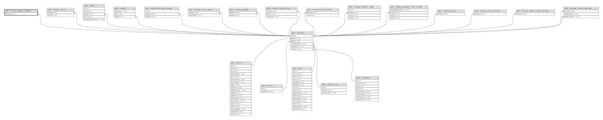

# public.lab_test_update_schedule

## Description

## Columns

| Name                 | Type                           | Default                                              | Nullable | Parents                               |
| -------------------- | ------------------------------ | ---------------------------------------------------- | -------- | ------------------------------------- |
| id                   | bigint                         | nextval('lab_test_update_schedule_id_seq'::regclass) | false    |                                       |
| partial_update_count | integer                        |                                                      | false    |                                       |
| checkup_id           | bigint                         |                                                      | false    | [public.checkups](public.checkups.md) |
| extra_data           | json                           |                                                      | false    |                                       |
| status               | varchar(255)                   |                                                      | false    |                                       |
| triggered_at         | timestamp(0) without time zone |                                                      | false    |                                       |
| created_at           | timestamp(0) without time zone |                                                      | true     |                                       |
| updated_at           | timestamp(0) without time zone |                                                      | true     |                                       |

## Constraints

| Name                                        | Type        | Definition                                       |
| ------------------------------------------- | ----------- | ------------------------------------------------ |
| lab_test_update_schedule_checkup_id_foreign | FOREIGN KEY | FOREIGN KEY (checkup_id) REFERENCES checkups(id) |
| lab_test_update_schedule_pkey               | PRIMARY KEY | PRIMARY KEY (id)                                 |

## Indexes

| Name                          | Definition                                                                                            |
| ----------------------------- | ----------------------------------------------------------------------------------------------------- |
| lab_test_update_schedule_pkey | CREATE UNIQUE INDEX lab_test_update_schedule_pkey ON public.lab_test_update_schedule USING btree (id) |

## Relations

---

> Generated by [tbls](https://github.com/k1LoW/tbls)
