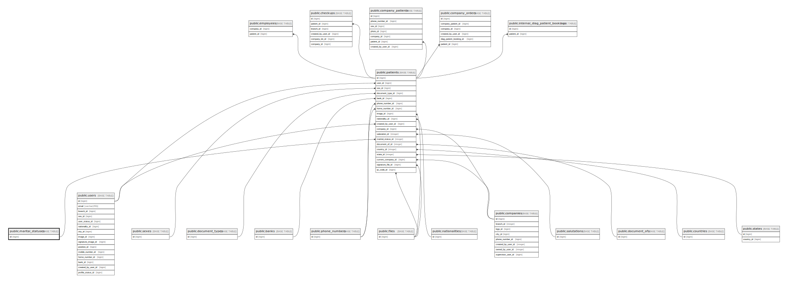

# public.marital_statuses

## Description

## Columns

| Name | Type         | Default                                      | Nullable | Children                              |
| ---- | ------------ | -------------------------------------------- | -------- | ------------------------------------- |
| id   | bigint       | nextval('marital_statuses_id_seq'::regclass) | false    | [public.patients](public.patients.md) |
| name | varchar(255) |                                              | false    |                                       |
| slug | varchar(255) |                                              | false    |                                       |

## Constraints

| Name                  | Type        | Definition       |
| --------------------- | ----------- | ---------------- |
| marital_statuses_pkey | PRIMARY KEY | PRIMARY KEY (id) |

## Indexes

| Name                  | Definition                                                                            |
| --------------------- | ------------------------------------------------------------------------------------- |
| marital_statuses_pkey | CREATE UNIQUE INDEX marital_statuses_pkey ON public.marital_statuses USING btree (id) |

## Relations

---

> Generated by [tbls](https://github.com/k1LoW/tbls)
