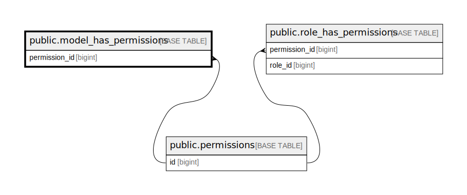

# public.model_has_permissions

## Description

## Columns

| Name          | Type         | Default | Nullable | Parents                                     |
| ------------- | ------------ | ------- | -------- | ------------------------------------------- |
| permission_id | bigint       |         | false    | [public.permissions](public.permissions.md) |
| model_type    | varchar(255) |         | false    |                                             |
| model_id      | bigint       |         | false    |                                             |

## Constraints

| Name                                        | Type        | Definition                                                               |
| ------------------------------------------- | ----------- | ------------------------------------------------------------------------ |
| model_has_permissions_permission_id_foreign | FOREIGN KEY | FOREIGN KEY (permission_id) REFERENCES permissions(id) ON DELETE CASCADE |
| model_has_permissions_pkey                  | PRIMARY KEY | PRIMARY KEY (permission_id, model_id, model_type)                        |

## Indexes

| Name                                            | Definition                                                                                                                       |
| ----------------------------------------------- | -------------------------------------------------------------------------------------------------------------------------------- |
| model_has_permissions_model_id_model_type_index | CREATE INDEX model_has_permissions_model_id_model_type_index ON public.model_has_permissions USING btree (model_id, model_type)  |
| model_has_permissions_pkey                      | CREATE UNIQUE INDEX model_has_permissions_pkey ON public.model_has_permissions USING btree (permission_id, model_id, model_type) |

## Relations

---

> Generated by [tbls](https://github.com/k1LoW/tbls)
