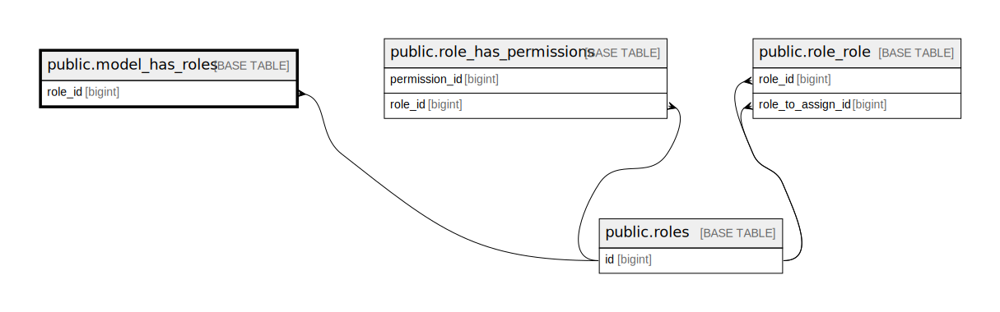

# public.model_has_roles

## Description

## Columns

| Name       | Type         | Default | Nullable | Parents                         |
| ---------- | ------------ | ------- | -------- | ------------------------------- |
| role_id    | bigint       |         | false    | [public.roles](public.roles.md) |
| model_type | varchar(255) |         | false    |                                 |
| model_id   | bigint       |         | false    |                                 |

## Constraints

| Name                            | Type        | Definition                                                   |
| ------------------------------- | ----------- | ------------------------------------------------------------ |
| model_has_roles_role_id_foreign | FOREIGN KEY | FOREIGN KEY (role_id) REFERENCES roles(id) ON DELETE CASCADE |
| model_has_roles_pkey            | PRIMARY KEY | PRIMARY KEY (role_id, model_id, model_type)                  |

## Indexes

| Name                                      | Definition                                                                                                          |
| ----------------------------------------- | ------------------------------------------------------------------------------------------------------------------- |
| model_has_roles_model_id_model_type_index | CREATE INDEX model_has_roles_model_id_model_type_index ON public.model_has_roles USING btree (model_id, model_type) |
| model_has_roles_pkey                      | CREATE UNIQUE INDEX model_has_roles_pkey ON public.model_has_roles USING btree (role_id, model_id, model_type)      |

## Relations

---

> Generated by [tbls](https://github.com/k1LoW/tbls)
