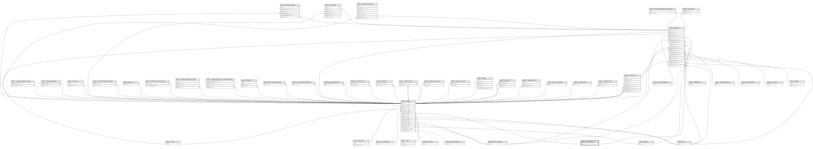

# public.nationalities

## Description

## Columns

| Name | Type         | Default                                   | Nullable | Children                                                              |
| ---- | ------------ | ----------------------------------------- | -------- | --------------------------------------------------------------------- |
| id   | bigint       | nextval('nationalities_id_seq'::regclass) | false    | [public.users](public.users.md) [public.patients](public.patients.md) |
| slug | varchar(255) |                                           | false    |                                                                       |
| name | varchar(255) |                                           | false    |                                                                       |

## Constraints

| Name                      | Type        | Definition       |
| ------------------------- | ----------- | ---------------- |
| nationalities_pkey        | PRIMARY KEY | PRIMARY KEY (id) |
| nationalities_slug_unique | UNIQUE      | UNIQUE (slug)    |

## Indexes

| Name                      | Definition                                                                               |
| ------------------------- | ---------------------------------------------------------------------------------------- |
| nationalities_pkey        | CREATE UNIQUE INDEX nationalities_pkey ON public.nationalities USING btree (id)          |
| nationalities_slug_unique | CREATE UNIQUE INDEX nationalities_slug_unique ON public.nationalities USING btree (slug) |

## Relations

---

> Generated by [tbls](https://github.com/k1LoW/tbls)
