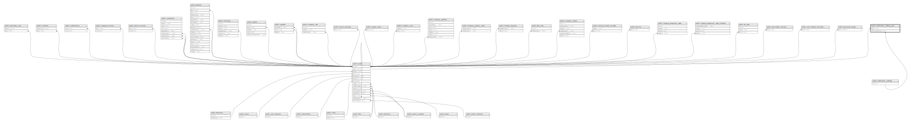

# public.notification_setting_user

## Description

## Columns

| Name                    | Type                           | Default                                               | Nullable | Parents                                                         |
| ----------------------- | ------------------------------ | ----------------------------------------------------- | -------- | --------------------------------------------------------------- |
| id                      | bigint                         | nextval('notification_setting_user_id_seq'::regclass) | false    |                                                                 |
| user_id                 | bigint                         |                                                       | true     | [public.users](public.users.md)                                 |
| is_subscribed           | boolean                        | true                                                  | false    |                                                                 |
| notification_setting_id | bigint                         |                                                       | true     | [public.notification_settings](public.notification_settings.md) |
| created_at              | timestamp(0) without time zone |                                                       | true     |                                                                 |
| updated_at              | timestamp(0) without time zone |                                                       | true     |                                                                 |

## Constraints

| Name                                                      | Type        | Definition                                                                                   |
| --------------------------------------------------------- | ----------- | -------------------------------------------------------------------------------------------- |
| notification_setting_user_user_id_foreign                 | FOREIGN KEY | FOREIGN KEY (user_id) REFERENCES users(id) ON DELETE CASCADE                                 |
| notification_setting_user_notification_setting_id_foreign | FOREIGN KEY | FOREIGN KEY (notification_setting_id) REFERENCES notification_settings(id) ON DELETE CASCADE |
| notification_setting_user_pkey                            | PRIMARY KEY | PRIMARY KEY (id)                                                                             |

## Indexes

| Name                                                    | Definition                                                                                                                                     |
| ------------------------------------------------------- | ---------------------------------------------------------------------------------------------------------------------------------------------- |
| notification_setting_user_pkey                          | CREATE UNIQUE INDEX notification_setting_user_pkey ON public.notification_setting_user USING btree (id)                                        |
| notification_setting_user_user_id_index                 | CREATE INDEX notification_setting_user_user_id_index ON public.notification_setting_user USING btree (user_id)                                 |
| notification_setting_user_notification_setting_id_index | CREATE INDEX notification_setting_user_notification_setting_id_index ON public.notification_setting_user USING btree (notification_setting_id) |

## Relations

---

> Generated by [tbls](https://github.com/k1LoW/tbls)
