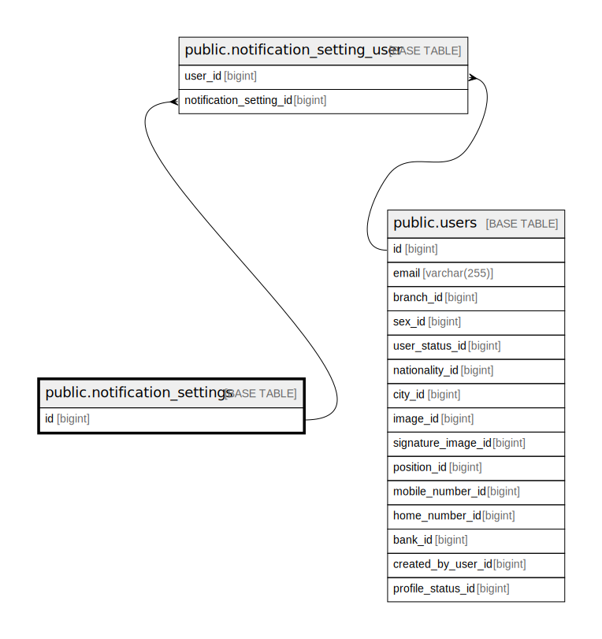

# public.notification_settings

## Description

## Columns

| Name      | Type         | Default                                           | Nullable | Children                                                                |
| --------- | ------------ | ------------------------------------------------- | -------- | ----------------------------------------------------------------------- |
| id        | bigint       | nextval('notification_settings_id_seq'::regclass) | false    | [public.notification_setting_user](public.notification_setting_user.md) |
| key       | varchar(255) |                                                   | false    |                                                                         |
| classname | varchar(255) |                                                   | false    |                                                                         |

## Constraints

| Name                                   | Type        | Definition         |
| -------------------------------------- | ----------- | ------------------ |
| notification_settings_pkey             | PRIMARY KEY | PRIMARY KEY (id)   |
| notification_settings_key_unique       | UNIQUE      | UNIQUE (key)       |
| notification_settings_classname_unique | UNIQUE      | UNIQUE (classname) |

## Indexes

| Name                                   | Definition                                                                                                         |
| -------------------------------------- | ------------------------------------------------------------------------------------------------------------------ |
| notification_settings_pkey             | CREATE UNIQUE INDEX notification_settings_pkey ON public.notification_settings USING btree (id)                    |
| notification_settings_key_unique       | CREATE UNIQUE INDEX notification_settings_key_unique ON public.notification_settings USING btree (key)             |
| notification_settings_classname_unique | CREATE UNIQUE INDEX notification_settings_classname_unique ON public.notification_settings USING btree (classname) |

## Relations

---

> Generated by [tbls](https://github.com/k1LoW/tbls)
