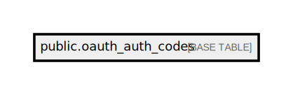

# public.oauth_auth_codes

## Description

## Columns

| Name       | Type                           | Default | Nullable |
| ---------- | ------------------------------ | ------- | -------- |
| id         | varchar(100)                   |         | false    |
| user_id    | bigint                         |         | false    |
| client_id  | uuid                           |         | false    |
| scopes     | text                           |         | true     |
| revoked    | boolean                        |         | false    |
| expires_at | timestamp(0) without time zone |         | true     |

## Constraints

| Name                  | Type        | Definition       |
| --------------------- | ----------- | ---------------- |
| oauth_auth_codes_pkey | PRIMARY KEY | PRIMARY KEY (id) |

## Indexes

| Name                  | Definition                                                                            |
| --------------------- | ------------------------------------------------------------------------------------- |
| oauth_auth_codes_pkey | CREATE UNIQUE INDEX oauth_auth_codes_pkey ON public.oauth_auth_codes USING btree (id) |

## Relations

---

> Generated by [tbls](https://github.com/k1LoW/tbls)
