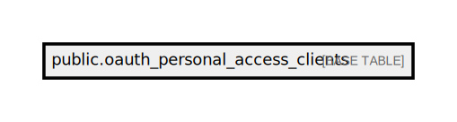

# public.oauth_personal_access_clients

## Description

## Columns

| Name       | Type                           | Default                                                   | Nullable |
| ---------- | ------------------------------ | --------------------------------------------------------- | -------- |
| id         | bigint                         | nextval('oauth_personal_access_clients_id_seq'::regclass) | false    |
| client_id  | uuid                           |                                                           | false    |
| created_at | timestamp(0) without time zone |                                                           | true     |
| updated_at | timestamp(0) without time zone |                                                           | true     |

## Constraints

| Name                               | Type        | Definition       |
| ---------------------------------- | ----------- | ---------------- |
| oauth_personal_access_clients_pkey | PRIMARY KEY | PRIMARY KEY (id) |

## Indexes

| Name                               | Definition                                                                                                      |
| ---------------------------------- | --------------------------------------------------------------------------------------------------------------- |
| oauth_personal_access_clients_pkey | CREATE UNIQUE INDEX oauth_personal_access_clients_pkey ON public.oauth_personal_access_clients USING btree (id) |

## Relations

---

> Generated by [tbls](https://github.com/k1LoW/tbls)
