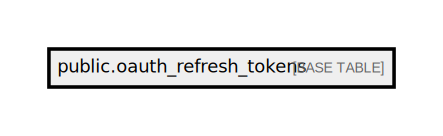

# public.oauth_refresh_tokens

## Description

## Columns

| Name            | Type                           | Default | Nullable |
| --------------- | ------------------------------ | ------- | -------- |
| id              | varchar(100)                   |         | false    |
| access_token_id | varchar(100)                   |         | false    |
| revoked         | boolean                        |         | false    |
| expires_at      | timestamp(0) without time zone |         | true     |

## Constraints

| Name                      | Type        | Definition       |
| ------------------------- | ----------- | ---------------- |
| oauth_refresh_tokens_pkey | PRIMARY KEY | PRIMARY KEY (id) |

## Indexes

| Name                      | Definition                                                                                    |
| ------------------------- | --------------------------------------------------------------------------------------------- |
| oauth_refresh_tokens_pkey | CREATE UNIQUE INDEX oauth_refresh_tokens_pkey ON public.oauth_refresh_tokens USING btree (id) |

## Relations

---

> Generated by [tbls](https://github.com/k1LoW/tbls)
