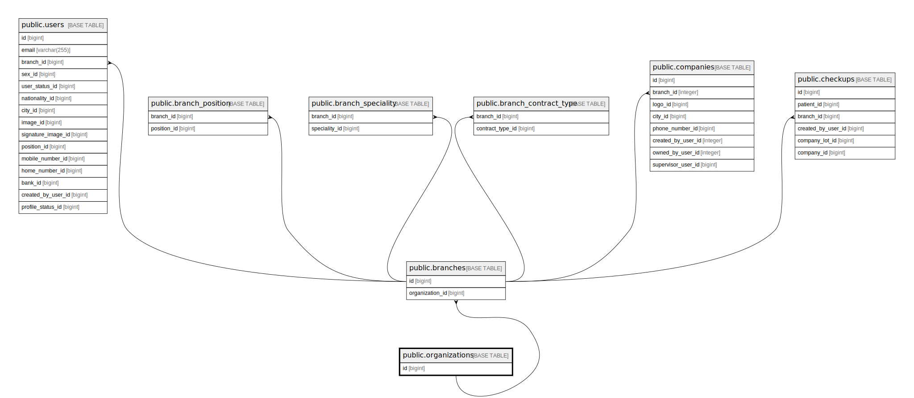

# public.organizations

## Description

## Columns

| Name       | Type                           | Default                                   | Nullable | Children                              |
| ---------- | ------------------------------ | ----------------------------------------- | -------- | ------------------------------------- |
| id         | bigint                         | nextval('organizations_id_seq'::regclass) | false    | [public.branches](public.branches.md) |
| name       | varchar(255)                   |                                           | false    |                                       |
| created_at | timestamp(0) without time zone |                                           | true     |                                       |
| updated_at | timestamp(0) without time zone |                                           | true     |                                       |

## Constraints

| Name               | Type        | Definition       |
| ------------------ | ----------- | ---------------- |
| organizations_pkey | PRIMARY KEY | PRIMARY KEY (id) |

## Indexes

| Name               | Definition                                                                      |
| ------------------ | ------------------------------------------------------------------------------- |
| organizations_pkey | CREATE UNIQUE INDEX organizations_pkey ON public.organizations USING btree (id) |

## Relations

---

> Generated by [tbls](https://github.com/k1LoW/tbls)
