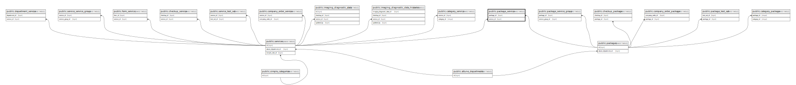

# public.package_service

## Description

## Columns

| Name       | Type   | Default                                     | Nullable | Parents                               |
| ---------- | ------ | ------------------------------------------- | -------- | ------------------------------------- |
| id         | bigint | nextval('package_service_id_seq'::regclass) | false    |                                       |
| package_id | bigint |                                             | false    | [public.packages](public.packages.md) |
| service_id | bigint |                                             | false    | [public.services](public.services.md) |

## Constraints

| Name                               | Type        | Definition                                                         |
| ---------------------------------- | ----------- | ------------------------------------------------------------------ |
| package_service_service_id_foreign | FOREIGN KEY | FOREIGN KEY (service_id) REFERENCES services(id) ON DELETE CASCADE |
| package_service_package_id_foreign | FOREIGN KEY | FOREIGN KEY (package_id) REFERENCES packages(id) ON DELETE CASCADE |
| package_service_pkey               | PRIMARY KEY | PRIMARY KEY (id)                                                   |

## Indexes

| Name                 | Definition                                                                          |
| -------------------- | ----------------------------------------------------------------------------------- |
| package_service_pkey | CREATE UNIQUE INDEX package_service_pkey ON public.package_service USING btree (id) |

## Relations

---

> Generated by [tbls](https://github.com/k1LoW/tbls)
