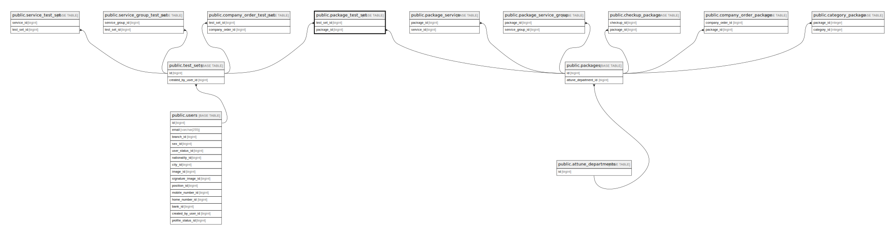

# public.package_test_set

## Description

## Columns

| Name        | Type                           | Default                                      | Nullable | Parents                                 |
| ----------- | ------------------------------ | -------------------------------------------- | -------- | --------------------------------------- |
| id          | bigint                         | nextval('package_test_set_id_seq'::regclass) | false    |                                         |
| test_set_id | bigint                         |                                              | false    | [public.test_sets](public.test_sets.md) |
| package_id  | bigint                         |                                              | false    | [public.packages](public.packages.md)   |
| created_at  | timestamp(0) without time zone |                                              | true     |                                         |
| updated_at  | timestamp(0) without time zone |                                              | true     |                                         |

## Constraints

| Name                             | Type        | Definition                                                         |
| -------------------------------- | ----------- | ------------------------------------------------------------------ |
| frn_package_test_set_test_set_id | FOREIGN KEY | FOREIGN KEY (test_set_id) REFERENCES test_sets(id)                 |
| frn_package_test_set_package_id  | FOREIGN KEY | FOREIGN KEY (package_id) REFERENCES packages(id) ON DELETE CASCADE |
| package_test_set_pkey            | PRIMARY KEY | PRIMARY KEY (id)                                                   |

## Indexes

| Name                             | Definition                                                                                         |
| -------------------------------- | -------------------------------------------------------------------------------------------------- |
| package_test_set_pkey            | CREATE UNIQUE INDEX package_test_set_pkey ON public.package_test_set USING btree (id)              |
| idx_package_test_set_test_set_id | CREATE INDEX idx_package_test_set_test_set_id ON public.package_test_set USING btree (test_set_id) |
| idx_package_test_set_package_id  | CREATE INDEX idx_package_test_set_package_id ON public.package_test_set USING btree (package_id)   |

## Relations

---

> Generated by [tbls](https://github.com/k1LoW/tbls)
