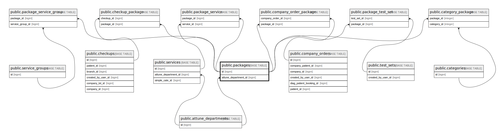

# public.packages

## Description

## Columns

| Name                 | Type                           | Default                              | Nullable | Children                                                                                                                                                                                                                                                                                                                                            | Parents                                                   |
| -------------------- | ------------------------------ | ------------------------------------ | -------- | --------------------------------------------------------------------------------------------------------------------------------------------------------------------------------------------------------------------------------------------------------------------------------------------------------------------------------------------------- | --------------------------------------------------------- |
| id                   | bigint                         | nextval('packages_id_seq'::regclass) | false    | [public.package_service](public.package_service.md) [public.package_service_group](public.package_service_group.md) [public.checkup_package](public.checkup_package.md) [public.company_order_package](public.company_order_package.md) [public.package_test_set](public.package_test_set.md) [public.category_package](public.category_package.md) |                                                           |
| test_code            | varchar(255)                   |                                      | false    |                                                                                                                                                                                                                                                                                                                                                     |                                                           |
| test_name            | varchar(255)                   |                                      | false    |                                                                                                                                                                                                                                                                                                                                                     |                                                           |
| attune_test_id       | varchar(255)                   |                                      | true     |                                                                                                                                                                                                                                                                                                                                                     |                                                           |
| gender               | varchar(255)                   |                                      | false    |                                                                                                                                                                                                                                                                                                                                                     |                                                           |
| orderable            | boolean                        |                                      | false    |                                                                                                                                                                                                                                                                                                                                                     |                                                           |
| attune_department_id | bigint                         |                                      | true     |                                                                                                                                                                                                                                                                                                                                                     | [public.attune_departments](public.attune_departments.md) |
| status               | varchar(255)                   |                                      | false    |                                                                                                                                                                                                                                                                                                                                                     |                                                           |
| created_at           | timestamp(0) without time zone |                                      | true     |                                                                                                                                                                                                                                                                                                                                                     |                                                           |
| updated_at           | timestamp(0) without time zone |                                      | true     |                                                                                                                                                                                                                                                                                                                                                     |                                                           |
| price                | varchar(255)                   | '0'::character varying               | true     |                                                                                                                                                                                                                                                                                                                                                     |                                                           |
| test_name_en         | varchar(255)                   |                                      | true     |                                                                                                                                                                                                                                                                                                                                                     |                                                           |
| test_name_vi         | varchar(255)                   |                                      | true     |                                                                                                                                                                                                                                                                                                                                                     |                                                           |
| alias_vi             | varchar(255)                   |                                      | true     |                                                                                                                                                                                                                                                                                                                                                     |                                                           |
| alias_non_vi         | varchar(255)                   |                                      | true     |                                                                                                                                                                                                                                                                                                                                                     |                                                           |
| section              | varchar(255)                   |                                      | true     |                                                                                                                                                                                                                                                                                                                                                     |                                                           |
| section_sq           | integer                        |                                      | true     |                                                                                                                                                                                                                                                                                                                                                     |                                                           |
| interpretation       | text                           |                                      | true     |                                                                                                                                                                                                                                                                                                                                                     |                                                           |
| interpretation_vi    | text                           |                                      | true     |                                                                                                                                                                                                                                                                                                                                                     |                                                           |
| category_hash        | varchar(255)                   |                                      | true     |                                                                                                                                                                                                                                                                                                                                                     |                                                           |
| section_vi           | varchar(255)                   |                                      | true     |                                                                                                                                                                                                                                                                                                                                                     |                                                           |
| test_details         | text                           |                                      | true     |                                                                                                                                                                                                                                                                                                                                                     |                                                           |
| test_details_vi      | text                           |                                      | true     |                                                                                                                                                                                                                                                                                                                                                     |                                                           |
| laboratory           | varchar(255)                   |                                      | true     |                                                                                                                                                                                                                                                                                                                                                     |                                                           |
| simple_name_en       | varchar(255)                   |                                      | true     |                                                                                                                                                                                                                                                                                                                                                     |                                                           |
| simple_name_vi       | varchar(255)                   |                                      | true     |                                                                                                                                                                                                                                                                                                                                                     |                                                           |
| external_id          | varchar(255)                   |                                      | true     |                                                                                                                                                                                                                                                                                                                                                     |                                                           |

## Constraints

| Name                                  | Type        | Definition                                                                              |
| ------------------------------------- | ----------- | --------------------------------------------------------------------------------------- |
| packages_attune_department_id_foreign | FOREIGN KEY | FOREIGN KEY (attune_department_id) REFERENCES attune_departments(id) ON DELETE SET NULL |
| packages_pkey                         | PRIMARY KEY | PRIMARY KEY (id)                                                                        |
| packages_attune_test_id_unique        | UNIQUE      | UNIQUE (attune_test_id)                                                                 |

## Indexes

| Name                           | Definition                                                                                         |
| ------------------------------ | -------------------------------------------------------------------------------------------------- |
| packages_pkey                  | CREATE UNIQUE INDEX packages_pkey ON public.packages USING btree (id)                              |
| packages_attune_test_id_unique | CREATE UNIQUE INDEX packages_attune_test_id_unique ON public.packages USING btree (attune_test_id) |
| packages_test_code_index       | CREATE INDEX packages_test_code_index ON public.packages USING btree (test_code)                   |

## Relations

---

> Generated by [tbls](https://github.com/k1LoW/tbls)
