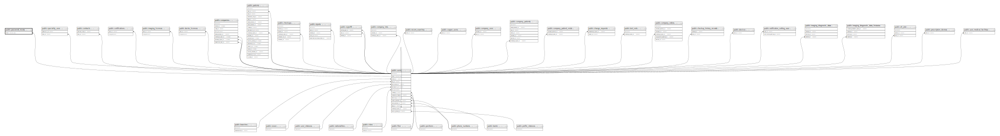

# public.password_resets

## Description

## Columns

| Name       | Type                           | Default                                     | Nullable | Parents                         |
| ---------- | ------------------------------ | ------------------------------------------- | -------- | ------------------------------- |
| id         | bigint                         | nextval('password_resets_id_seq'::regclass) | false    |                                 |
| token      | varchar(255)                   |                                             | false    |                                 |
| email      | varchar(255)                   |                                             | false    | [public.users](public.users.md) |
| created_at | timestamp(0) without time zone |                                             | true     |                                 |
| updated_at | timestamp(0) without time zone |                                             | true     |                                 |

## Constraints

| Name                          | Type        | Definition                                                    |
| ----------------------------- | ----------- | ------------------------------------------------------------- |
| password_resets_email_foreign | FOREIGN KEY | FOREIGN KEY (email) REFERENCES users(email) ON DELETE CASCADE |
| password_resets_pkey          | PRIMARY KEY | PRIMARY KEY (id)                                              |
| password_resets_email_unique  | UNIQUE      | UNIQUE (email)                                                |

## Indexes

| Name                         | Definition                                                                                     |
| ---------------------------- | ---------------------------------------------------------------------------------------------- |
| password_resets_pkey         | CREATE UNIQUE INDEX password_resets_pkey ON public.password_resets USING btree (id)            |
| password_resets_email_unique | CREATE UNIQUE INDEX password_resets_email_unique ON public.password_resets USING btree (email) |

## Relations

---

> Generated by [tbls](https://github.com/k1LoW/tbls)
