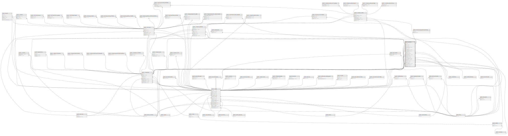

# public.patients

## Description

## Columns

| Name                  | Type                           | Default                              | Nullable | Children                                                                                                                                                                                                                                                                | Parents                                               |
| --------------------- | ------------------------------ | ------------------------------------ | -------- | ----------------------------------------------------------------------------------------------------------------------------------------------------------------------------------------------------------------------------------------------------------------------- | ----------------------------------------------------- |
| id                    | bigint                         | nextval('patients_id_seq'::regclass) | false    | [public.employees](public.employees.md) [public.checkups](public.checkups.md) [public.company_patients](public.company_patients.md) [public.company_orders](public.company_orders.md) [public.internal_diag_patient_bookings](public.internal_diag_patient_bookings.md) |                                                       |
| email                 | varchar(255)                   |                                      | true     |                                                                                                                                                                                                                                                                         |                                                       |
| first_name            | varchar(255)                   |                                      | true     |                                                                                                                                                                                                                                                                         |                                                       |
| middle_name           | varchar(255)                   |                                      | true     |                                                                                                                                                                                                                                                                         |                                                       |
| family_name           | varchar(255)                   |                                      | true     |                                                                                                                                                                                                                                                                         |                                                       |
| address               | varchar(255)                   |                                      | true     |                                                                                                                                                                                                                                                                         |                                                       |
| date_of_birth         | timestamp(0) without time zone |                                      | true     |                                                                                                                                                                                                                                                                         |                                                       |
| user_id               | bigint                         |                                      | true     |                                                                                                                                                                                                                                                                         | [public.users](public.users.md)                       |
| sex_id                | bigint                         |                                      | true     |                                                                                                                                                                                                                                                                         | [public.sexes](public.sexes.md)                       |
| document_type_id      | bigint                         |                                      | true     |                                                                                                                                                                                                                                                                         | [public.document_types](public.document_types.md)     |
| bank_id               | bigint                         |                                      | true     |                                                                                                                                                                                                                                                                         | [public.banks](public.banks.md)                       |
| phone_number_id       | bigint                         |                                      | true     |                                                                                                                                                                                                                                                                         | [public.phone_numbers](public.phone_numbers.md)       |
| home_number_id        | bigint                         |                                      | true     |                                                                                                                                                                                                                                                                         | [public.phone_numbers](public.phone_numbers.md)       |
| image_id              | bigint                         |                                      | true     |                                                                                                                                                                                                                                                                         | [public.files](public.files.md)                       |
| nationality_id        | bigint                         |                                      | true     |                                                                                                                                                                                                                                                                         | [public.nationalities](public.nationalities.md)       |
| created_by_user_id    | bigint                         |                                      | true     |                                                                                                                                                                                                                                                                         | [public.users](public.users.md)                       |
| created_at            | timestamp(0) without time zone |                                      | true     |                                                                                                                                                                                                                                                                         |                                                       |
| updated_at            | timestamp(0) without time zone |                                      | true     |                                                                                                                                                                                                                                                                         |                                                       |
| company_id            | bigint                         |                                      | true     |                                                                                                                                                                                                                                                                         | [public.companies](public.companies.md)               |
| attune_patient_id     | varchar(255)                   |                                      | true     |                                                                                                                                                                                                                                                                         |                                                       |
| salutation_id         | integer                        |                                      | true     |                                                                                                                                                                                                                                                                         | [public.salutations](public.salutations.md)           |
| marital_status_id     | integer                        |                                      | true     |                                                                                                                                                                                                                                                                         | [public.marital_statuses](public.marital_statuses.md) |
| document_of_id        | integer                        |                                      | true     |                                                                                                                                                                                                                                                                         | [public.document_ofs](public.document_ofs.md)         |
| country_id            | integer                        |                                      | true     |                                                                                                                                                                                                                                                                         | [public.countries](public.countries.md)               |
| state_id              | integer                        |                                      | true     |                                                                                                                                                                                                                                                                         | [public.states](public.states.md)                     |
| address_type          | varchar(255)                   |                                      | true     |                                                                                                                                                                                                                                                                         |                                                       |
| suburb                | varchar(255)                   |                                      | true     |                                                                                                                                                                                                                                                                         |                                                       |
| city                  | varchar(255)                   |                                      | true     |                                                                                                                                                                                                                                                                         |                                                       |
| current_company_id    | bigint                         |                                      | true     |                                                                                                                                                                                                                                                                         | [public.companies](public.companies.md)               |
| signature_file_id     | bigint                         |                                      | true     |                                                                                                                                                                                                                                                                         | [public.files](public.files.md)                       |
| patient_hash          | varchar(255)                   |                                      | true     |                                                                                                                                                                                                                                                                         |                                                       |
| qr_code_id            | bigint                         |                                      | true     |                                                                                                                                                                                                                                                                         | [public.files](public.files.md)                       |
| attune_patient_number | varchar(255)                   |                                      | true     |                                                                                                                                                                                                                                                                         |                                                       |
| postal_code           | varchar(255)                   |                                      | true     |                                                                                                                                                                                                                                                                         |                                                       |

## Constraints

| Name                                | Type        | Definition                                                                         |
| ----------------------------------- | ----------- | ---------------------------------------------------------------------------------- |
| patients_created_by_user_id_foreign | FOREIGN KEY | FOREIGN KEY (created_by_user_id) REFERENCES users(id) ON DELETE SET NULL           |
| patients_user_id_foreign            | FOREIGN KEY | FOREIGN KEY (user_id) REFERENCES users(id) ON DELETE SET NULL                      |
| patients_sex_id_foreign             | FOREIGN KEY | FOREIGN KEY (sex_id) REFERENCES sexes(id) ON DELETE SET NULL                       |
| patients_nationality_id_foreign     | FOREIGN KEY | FOREIGN KEY (nationality_id) REFERENCES nationalities(id) ON DELETE SET NULL       |
| patients_country_id_foreign         | FOREIGN KEY | FOREIGN KEY (country_id) REFERENCES countries(id) ON DELETE SET NULL               |
| patients_state_id_foreign           | FOREIGN KEY | FOREIGN KEY (state_id) REFERENCES states(id) ON DELETE SET NULL                    |
| patients_document_type_id_foreign   | FOREIGN KEY | FOREIGN KEY (document_type_id) REFERENCES document_types(id) ON DELETE SET NULL    |
| patients_image_id_foreign           | FOREIGN KEY | FOREIGN KEY (image_id) REFERENCES files(id) ON DELETE SET NULL                     |
| patients_qr_code_id_foreign         | FOREIGN KEY | FOREIGN KEY (qr_code_id) REFERENCES files(id) ON DELETE SET NULL                   |
| patients_signature_file_id_foreign  | FOREIGN KEY | FOREIGN KEY (signature_file_id) REFERENCES files(id) ON DELETE SET NULL            |
| patients_home_number_id_foreign     | FOREIGN KEY | FOREIGN KEY (home_number_id) REFERENCES phone_numbers(id) ON DELETE SET NULL       |
| patients_phone_number_id_foreign    | FOREIGN KEY | FOREIGN KEY (phone_number_id) REFERENCES phone_numbers(id) ON DELETE SET NULL      |
| patients_bank_id_foreign            | FOREIGN KEY | FOREIGN KEY (bank_id) REFERENCES banks(id) ON DELETE SET NULL                      |
| patients_company_id_foreign         | FOREIGN KEY | FOREIGN KEY (company_id) REFERENCES companies(id) ON DELETE CASCADE                |
| patients_current_company_id_foreign | FOREIGN KEY | FOREIGN KEY (current_company_id) REFERENCES companies(id) ON DELETE SET NULL       |
| patients_pkey                       | PRIMARY KEY | PRIMARY KEY (id)                                                                   |
| patients_marital_status_id_foreign  | FOREIGN KEY | FOREIGN KEY (marital_status_id) REFERENCES marital_statuses(id) ON DELETE SET NULL |
| patients_salutation_id_foreign      | FOREIGN KEY | FOREIGN KEY (salutation_id) REFERENCES salutations(id) ON DELETE SET NULL          |
| patients_document_of_id_foreign     | FOREIGN KEY | FOREIGN KEY (document_of_id) REFERENCES document_ofs(id) ON DELETE SET NULL        |
| patients_patient_hash_unique        | UNIQUE      | UNIQUE (patient_hash)                                                              |
| attune_id_unique                    | UNIQUE      | UNIQUE (attune_patient_id, attune_patient_number)                                  |

## Indexes

| Name                                    | Definition                                                                                                                                                   |
| --------------------------------------- | ------------------------------------------------------------------------------------------------------------------------------------------------------------ |
| patients_pkey                           | CREATE UNIQUE INDEX patients_pkey ON public.patients USING btree (id)                                                                                        |
| patients_patient_hash_unique            | CREATE UNIQUE INDEX patients_patient_hash_unique ON public.patients USING btree (patient_hash)                                                               |
| patients_first_name_index               | CREATE INDEX patients_first_name_index ON public.patients USING btree (first_name)                                                                           |
| patients_phone_number_id_index          | CREATE INDEX patients_phone_number_id_index ON public.patients USING btree (phone_number_id)                                                                 |
| patients_first_name_date_of_birth_index | CREATE INDEX patients_first_name_date_of_birth_index ON public.patients USING btree (first_name, date_of_birth)                                              |
| patients_current_company_id_index       | CREATE INDEX patients_current_company_id_index ON public.patients USING btree (current_company_id)                                                           |
| attune_id_unique                        | CREATE UNIQUE INDEX attune_id_unique ON public.patients USING btree (attune_patient_id, attune_patient_number)                                               |
| idx_atune_patients_number               | CREATE INDEX idx_atune_patients_number ON public.patients USING btree (attune_patient_number DESC) WHERE (attune_patient_number IS NOT NULL)                 |
| idx_lower_atune_patients_number         | CREATE INDEX idx_lower_atune_patients_number ON public.patients USING btree (lower((attune_patient_number)::text)) WHERE (attune_patient_number IS NOT NULL) |
| patients_search_date_of_birth_idx       | CREATE INDEX patients_search_date_of_birth_idx ON public.patients USING btree (date(date_of_birth))                                                          |
| idx_org_brch_chkp_patients              | CREATE INDEX idx_org_brch_chkp_patients ON public.patients USING btree (id, sex_id, phone_number_id)                                                         |

## Relations

---

> Generated by [tbls](https://github.com/k1LoW/tbls)
