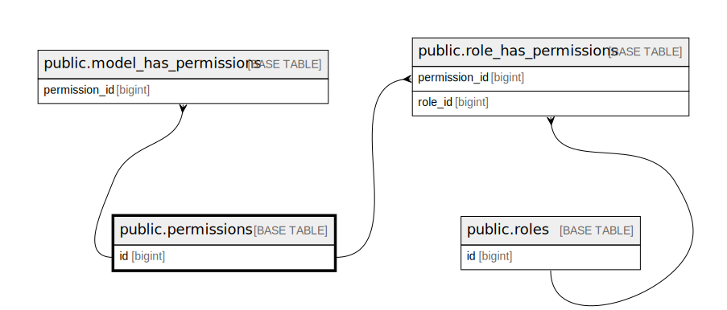

# public.permissions

## Description

## Columns

| Name       | Type                           | Default                                 | Nullable | Children                                                                                                                      |
| ---------- | ------------------------------ | --------------------------------------- | -------- | ----------------------------------------------------------------------------------------------------------------------------- |
| id         | bigint                         | nextval('permissions_id_seq'::regclass) | false    | [public.model_has_permissions](public.model_has_permissions.md) [public.role_has_permissions](public.role_has_permissions.md) |
| name       | varchar(255)                   |                                         | false    |                                                                                                                               |
| guard_name | varchar(255)                   |                                         | false    |                                                                                                                               |
| created_at | timestamp(0) without time zone |                                         | true     |                                                                                                                               |
| updated_at | timestamp(0) without time zone |                                         | true     |                                                                                                                               |

## Constraints

| Name             | Type        | Definition       |
| ---------------- | ----------- | ---------------- |
| permissions_pkey | PRIMARY KEY | PRIMARY KEY (id) |

## Indexes

| Name             | Definition                                                                  |
| ---------------- | --------------------------------------------------------------------------- |
| permissions_pkey | CREATE UNIQUE INDEX permissions_pkey ON public.permissions USING btree (id) |

## Relations

---

> Generated by [tbls](https://github.com/k1LoW/tbls)
