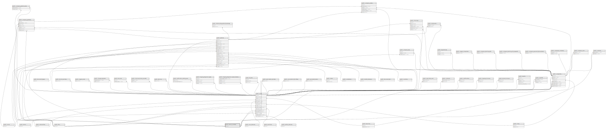

# public.phone_numbers

## Description

## Columns

| Name       | Type                           | Default                                   | Nullable | Children                                                                                                                                                                                                  |
| ---------- | ------------------------------ | ----------------------------------------- | -------- | --------------------------------------------------------------------------------------------------------------------------------------------------------------------------------------------------------- |
| id         | bigint                         | nextval('phone_numbers_id_seq'::regclass) | false    | [public.users](public.users.md) [public.companies](public.companies.md) [public.patients](public.patients.md) [public.contacts](public.contacts.md) [public.company_patients](public.company_patients.md) |
| number     | varchar(255)                   |                                           | false    |                                                                                                                                                                                                           |
| created_at | timestamp(0) without time zone |                                           | true     |                                                                                                                                                                                                           |
| updated_at | timestamp(0) without time zone |                                           | true     |                                                                                                                                                                                                           |

## Constraints

| Name               | Type        | Definition       |
| ------------------ | ----------- | ---------------- |
| phone_numbers_pkey | PRIMARY KEY | PRIMARY KEY (id) |

## Indexes

| Name                          | Definition                                                                                                         |
| ----------------------------- | ------------------------------------------------------------------------------------------------------------------ |
| phone_numbers_pkey            | CREATE UNIQUE INDEX phone_numbers_pkey ON public.phone_numbers USING btree (id)                                    |
| phone_numbers_number_index    | CREATE INDEX phone_numbers_number_index ON public.phone_numbers USING btree (number)                               |
| idx_phone_numbers_number_trgm | CREATE INDEX idx_phone_numbers_number_trgm ON public.phone_numbers USING gin (TRIM(BOTH FROM number) gin_trgm_ops) |

## Relations

---

> Generated by [tbls](https://github.com/k1LoW/tbls)
