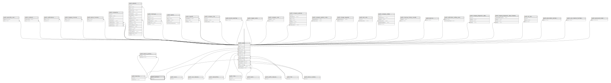

# public.positions

## Description

## Columns

| Name | Type         | Default                               | Nullable | Children                                                                            |
| ---- | ------------ | ------------------------------------- | -------- | ----------------------------------------------------------------------------------- |
| id   | bigint       | nextval('positions_id_seq'::regclass) | false    | [public.users](public.users.md) [public.branch_position](public.branch_position.md) |
| slug | varchar(255) |                                       | false    |                                                                                     |
| name | varchar(255) |                                       | false    |                                                                                     |

## Constraints

| Name                  | Type        | Definition       |
| --------------------- | ----------- | ---------------- |
| positions_pkey        | PRIMARY KEY | PRIMARY KEY (id) |
| positions_slug_unique | UNIQUE      | UNIQUE (slug)    |

## Indexes

| Name                  | Definition                                                                       |
| --------------------- | -------------------------------------------------------------------------------- |
| positions_pkey        | CREATE UNIQUE INDEX positions_pkey ON public.positions USING btree (id)          |
| positions_slug_unique | CREATE UNIQUE INDEX positions_slug_unique ON public.positions USING btree (slug) |

## Relations

---

> Generated by [tbls](https://github.com/k1LoW/tbls)
