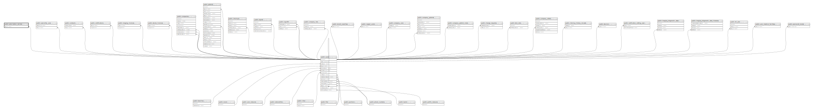

# public.prescription_doctors

## Description

## Columns

| Name       | Type                           | Default                                          | Nullable | Parents                         |
| ---------- | ------------------------------ | ------------------------------------------------ | -------- | ------------------------------- |
| id         | bigint                         | nextval('prescription_doctors_id_seq'::regclass) | false    |                                 |
| user_id    | bigint                         |                                                  | false    | [public.users](public.users.md) |
| doctor_id  | varchar(255)                   |                                                  | false    |                                 |
| created_at | timestamp(0) without time zone |                                                  | true     |                                 |
| updated_at | timestamp(0) without time zone |                                                  | true     |                                 |

## Constraints

| Name                                 | Type        | Definition                                 |
| ------------------------------------ | ----------- | ------------------------------------------ |
| prescription_doctors_user_id_foreign | FOREIGN KEY | FOREIGN KEY (user_id) REFERENCES users(id) |
| prescription_doctors_pkey            | PRIMARY KEY | PRIMARY KEY (id)                           |

## Indexes

| Name                      | Definition                                                                                    |
| ------------------------- | --------------------------------------------------------------------------------------------- |
| prescription_doctors_pkey | CREATE UNIQUE INDEX prescription_doctors_pkey ON public.prescription_doctors USING btree (id) |

## Relations

---

> Generated by [tbls](https://github.com/k1LoW/tbls)
