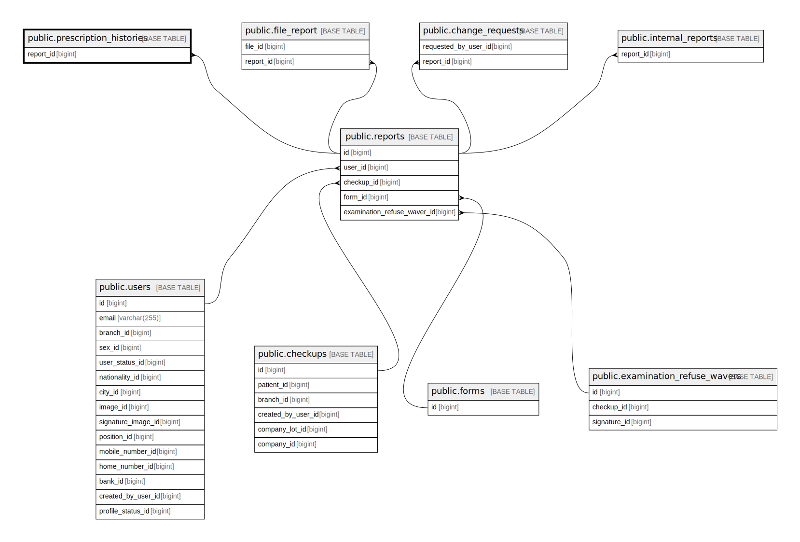

# public.prescription_histories

## Description

## Columns

| Name            | Type                           | Default                                            | Nullable | Parents                             |
| --------------- | ------------------------------ | -------------------------------------------------- | -------- | ----------------------------------- |
| id              | bigint                         | nextval('prescription_histories_id_seq'::regclass) | false    |                                     |
| prescription_id | varchar(255)                   |                                                    | true     |                                     |
| submit_data     | json                           |                                                    | true     |                                     |
| response_data   | json                           |                                                    | true     |                                     |
| submitted_at    | timestamp(0) without time zone |                                                    | true     |                                     |
| created_at      | timestamp(0) without time zone |                                                    | true     |                                     |
| updated_at      | timestamp(0) without time zone |                                                    | true     |                                     |
| report_id       | bigint                         |                                                    | true     | [public.reports](public.reports.md) |
| submit_status   | varchar(255)                   |                                                    | true     |                                     |

## Constraints

| Name                                     | Type        | Definition                                     |
| ---------------------------------------- | ----------- | ---------------------------------------------- |
| prescription_histories_report_id_foreign | FOREIGN KEY | FOREIGN KEY (report_id) REFERENCES reports(id) |
| prescription_histories_pkey              | PRIMARY KEY | PRIMARY KEY (id)                               |

## Indexes

| Name                                         | Definition                                                                                                               |
| -------------------------------------------- | ------------------------------------------------------------------------------------------------------------------------ |
| prescription_histories_pkey                  | CREATE UNIQUE INDEX prescription_histories_pkey ON public.prescription_histories USING btree (id)                        |
| prescription_histories_report_id_index       | CREATE INDEX prescription_histories_report_id_index ON public.prescription_histories USING btree (report_id)             |
| prescription_histories_prescription_id_index | CREATE INDEX prescription_histories_prescription_id_index ON public.prescription_histories USING btree (prescription_id) |
| prescription_histories_submit_status_index   | CREATE INDEX prescription_histories_submit_status_index ON public.prescription_histories USING btree (submit_status)     |

## Relations

---

> Generated by [tbls](https://github.com/k1LoW/tbls)
